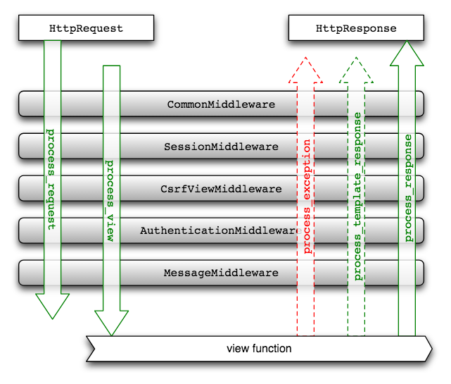

# 玩转Django2.0

[TOC]


## 第一章： Django建站基础


一个完整的网站大概包含：域名、网站应用和服务器

域名：网站的链接

网站应用：网站内容及功能

服务器：用于应用的部署和上线


### 1.1 网站的定义及组成


**网站**（Website）：

指再因特网上根据一定的规则，实用HTML等工具制作并用于展示特定内容相关网页的集合。

网站时一种沟通工具


早期网站基本组成部分：域名、空间服务器与程序

目前大多数网站由域名、空间服务器、DNS域名解析、网站程序和数据库等组成


**域名**（Domain Name）：

是由一串用点分隔的字母组成，代表互联网上某一台计算机或计算机组的名称

作用：在数据传输时标识计算机的电子方位

域名就相当于一个家庭的门牌号码，别人通过这个号码可以很容易找到你所在的位置。


> eg：
>
> www.baidu.com
>
> “baidu”是这个域名的主域名体
>
> “www”是网络名
>
> “com”是该域名的后缀，代表国际域名


常见的域名后缀：

- `.com`：商业性的机构或公司
- `.net`：从事Internet相关的网络服务的机构或公司
- `.org`：非营利的组织、团体
- `.gov`：政府部门
- `.cn`：中国国内域名
- `.com.cn`：中国商业域名
- `.net.cn`：中国从事Internet相关的网络服务的机构或公司
- `.org.cn`：中国非营利的组织、团体
- `.gov.cn`：中国政府部门


**空间服务器**

主要有虚拟主机、独立服务器和VPS。

1. 虚拟主机：在网络服务器上划分出一定的磁盘空间供用户放置站点和应用组件等，提供必要的站点功能、数据存放和传输功能。

   虚拟主机促进了网络技术的应用和普及

2. 独立服务器：性能更强大、整体硬件完全独立的服务器，CPU一般在8核心以上

3. VPS即虚拟专用服务器：将一个服务器区分成多个虚拟独立专享服务器技术


**网站程序**：

建设与修改网站所使用的编程语言

源代码是按一定格式书写的文字和符号编写的

常见的网站开发语言：Java、PHP、ASP.NET和Python


**浏览器**如程序的编译器，他会将源代码翻译成图文内容呈现在网页上


### 1.2 网站的分类


**资讯门户类网站**

是目前普遍的网站形式之一。例如：新浪、搜狐、新华网等

以提供信息资讯为主要目的

特点：涵盖信息类型多、信息量大和访问群体广，但包含的功能比较简单

技术含量：

- 承载的信息类型
- 信息发布的方式和流程
- 信息量的数量级
- 网站的用户管理


**企业品牌类网站**

用于展示企业综合实力，体现企业文化和品牌理念

该类网站非常强调创意，网站内容组织策划和产品展示体验方面也有较高的要求

细分：

- 企业形象网站
- 品牌形象网站
- 产品形象网站


**交易类网站**

以实现交易为目的，以订单为中心

三项基本内容：

- 商品如何展示
- 订单如何生成
- 订单如何执行

这类网站一般需要有产品管理、订购管理、订单管理、产品推荐、支付管理、收费管理、送发货管理和会员管理等基本功能

功能复杂一些还需要积分管理系统、VIP管理系统、CRM系统、MIS系统、ERP系统和商品销售分析系统等

细分：

- B2C(Business To Consumer)：商家——消费者，主要是购物网站，用于商家和消费者之间的买卖，如传统的百货商店和购物广场等
- B2B(Business To Business)：商家——商家，主要是商务网站，用于商家之间的买卖，如传统的原材料市场和大型批发市场
- C2C(Consumer To Consumer)：消费者——消费者，主要以拍卖网站为主，用于个人物品的买卖，如传统的旧货市场、跳蚤市场、废品收购站等


**企业办公事务类网站**

主要包括企业办公事务管理系统、人力资源管理系统和办公成本管理系统


**政府办公类网站**

利用政府专用网络和内部办公网络而建立的内部门户信息网

目的方便办公区域以外的相关部门互通信息、统一数据处理和共享文件资料

基本功能：

- 提供多数据源接口，实现业务系统的数据整合
- 统一用户管理，提供方便有效的访问权限和管理权限体系
- 灵活设立子网站，实现复杂的信息发布管理流程


**互动游戏网站**

近年来国内主键风靡起来的一种网站

这类网站的投入是根据所承载游戏的复杂程度来定的，其发展趋势是向超巨型方向发展


**功能性网站**

是一种新型网站，Google和百度是典型代表

特征：将一个具有广泛需求的功能扩展开来，开发一套强大的功能体系，将功能的实现推向极致


### 1.3 网站运行原理及开发流程


先了解一些常用术语

**客户端**：在计算机上运行并连接到互联网的应用程序，简称浏览器

		用户通过操作客户端实现网站和用户之间的数据交互


**服务器**：能连接到互联网且具有IP地址的计算机

		服务器主要接收和处理用户的请求信息
	
		当用户在客户端操作网页的时候，实质是向网站发送一个HTTP请求，网站的服务器接收到请求后会执行相应的处理，最后将处理结果返回到客户端并生成相应的网页信息


**IP地址**：互联网协议地址，TCP/IP网络设备的数字标识符。

		互联网上每台计算机都有一个IP地址，用于识别和通信
	
		IP地址有4组数字，以小数点分隔，被称为逻辑地址


**域名**：用于标识一个或多个IP地址


**DNS**：域名系统，用于跟踪计算机的域名及其在互联网上相应的IP地址


**ISP**：互联网服务提供商。

	主要作用是在DNS查找当前域名对应的IP地址


**TCP/IP**：传输控制协议/互联网协议，是广泛使用的通信协议


**HTTP**：超文本传输协议，浏览器和服务器通过互联网进行通信的协议


通过一个简单的例子来讲解网站运行原理：

1. 在浏览器中输入网址，如www.github.com
2. 浏览器解析网站地址中包含的信息，如HTTP协议和域名（github.con）
3. 浏览器与ISP通信，在DNS查找www.github.com所对应的IP地址，然后将IP地址发送到浏览器的DNS服务，最后向www.github.com的IP地址发送请求
4. 浏览器从网站地址中获取IP地址和端口（HTTP协议默认端口为80，HTTPS默认443），并打开TCP套接字连接，实现浏览器和Web服务器的连接
5. 浏览器根据用户操作向服务器发送相应的HTTP请求，如打开www.github.com主页面
6. 当Web服务器接收请求后，根据请求信息查找该HTML页面。如果页面存在，则Web服务器将处理结果和页面返回到浏览器；如果服务器找不到页面，将发送一个404错误信息，代表找不到相关页面


完整的开发流程：

- 需求分析
- 规划静态内容
- 设计阶段
- 程序开发阶段
- 测试和上线
- 维护和推广


### 1.4 走进Django


Django是一个开放源代码的Web应用框架，由Python写成

最初用于管理劳伦斯出版集团旗下的一些以新闻内容为主的网站，即CMS（内容管理系统）软件

2005年7月在BSD许可证下发布，以比利时的吉普赛爵士吉他手DjangoReinhardt来命名


Django采用了MTV框架模式：模型（model）、模板（template）和视图（views），三者之间各自负责不同的职责

- 模型：数据存取层，处理与数据相关的所有事务，如存取、验证有效性、数据关系等
- 视图：表现层，处理与表现相关的决定，如页面的显示等
- 模板：业务逻辑层，存取模型及调取恰当模板的相关逻辑，模型与模板的桥梁


主要目的：简便、快速地开发数据库驱动的网站


强调代码复用，多个组件可以以插件的形式服务于整个框架

有很强的可扩展性，Django有许多功能强大的第三方插件


Django基于MVC的设计十分优美：

- 对象关系映射（Object Relational Mapping, ORM）：通过定义映射来构建数据模型，将模型与关系数据库连接起来，使用ORM框架内置的数据接口可实现复杂的数据操作
- URL设计：开发者可以设计任意的URL（网站地址），而且还支持使用正则表达式设计
- 模板系统：提供可扩展的模板语言，模板之间具有可继承性
- 表单处理：可以生成各种表单模型，而且表达具有有效性检验功能
- Cache系统：完善的缓存系统，可支持多种缓存方式
- 用户管理系统：提供用户认证、权限设置和用户组功能，功能扩展性强
- 国际化：内置国际化系统，方便开发出多种语言的网站
- admin管理系统：内置admin管理系统，系统扩展性强


### 1.5 Django2.0 的新特性


2017年12月2日，Django官方发布了2.0版本

主要特性是Django2.0支持Python3.4、3.5和3.6，不再支持Python2

Django1.11是支持Python2.7的最后版本


- 简化URL路由语法
- admin管理系统支持主流的移动设备并新增几个属性和方法
- 用户认证
- Cache缓存
- 通用视图
- Pagination分页
- Tempaltes模板
- Validators验证器
- File Storage文件存储
- 连接MySQL不再使用mysqldb模块，改用mysqlclient
- Management Commands管理命令


### 1.6 安装Django


```shell
pip install Django
```


交互解释器下输入校验代码

```python
import django
django.__version__
```


### 1.7 创建项目


一个项目可以理解为一个网站


命令行创建项目

```shell
django-admin startproject MyDjango
```


`MyDjango`为项目名称，可自行命名


项目结构


- `manage.py`：命令行工具，允许以多种方式与项目进行交互。

  			在cmd窗口下，将路径切换到MyDjango项目并输入`python manage.py help`可以查看该工具的具体功能

- `__init__.py`：初始化文件，一般情况下无需修改

- `settings.py`：项目的配置文件

- `urls.py`：项目的URL设置，可理解为网站的地址信息

- `wsgi.py`：全称为Python Web Server Gateway Interface

  			即Python服务器网关接口，是Python应用于Web服务器之间的接口，用于Django项目在服务器上的部署和上线，一般不需要修改


命令行创建应用，项目应用简称为App

相当于网站的功能，每个App代表网站的一个或多个网页

```shell
cd MyDjango
python manage.py startapp index
```


目录结构


- `migrations`： 用于数据库数据的迁移
- `__init__.py`： 初始化文件
- `admin.py`： 当前App的后台管理系统
- `apps.py`： 当前App的配置信息，在Django1.9版本后自动生成，一般情况下无需修改
- `models.py`： 定义映射类关联数据库，实现数据持久化，即MTV里面的模型（Model）
- `tests.py`： 自动化测试的模块
- `views.py`： 逻辑处理模块，即MTV里面的视图（Views）


运行项目

```shell
python manage.py runserver 80
```


其中`80`为端口号，若不设置端口，默认为8000

然后在浏览器上输入`http://127.0.0.1:80/`可看到项目启动情况


### 1.8 PyCharm 搭建开发环境


打开PyCharm，并在左上方单击`File->New Project`创建新项目


目录结构多出了一个`templates`文件夹，该文件夹用于存放HTML文件


如果项目是由PyCharm创建的，可直接单击“运行”按钮启动项目


## 第二章： Django配置信息


项目配置是根据实际开发需求从而对整个Web框架编写相关配置信息

配置信息主要由项目的`settings.py`实现

主要配置：

- 项目路径
- 密钥配置
- 域名访问权限
- App列表
- 配置静态资源
- 配置模板文件
- 数据库配置
- 中间件配置
- 缓存配置


### 2.1 基本配置信息


一个简单的项目必须具备的基本配置信息有：项目路径、密钥配置、域名访问权限、App列表和中间件


```python
import os
# 项目路径
# Build paths inside the project like this: os.path.join(BASE_DIR, ...)
BASE_DIR = os.path.dirname(os.path.dirname(os.path.abspath(__file__)))


# Quick-start development settings - unsuitable for production
# See https://docs.djangoproject.com/en/1.11/howto/deployment/checklist/
# 密钥配置
# SECURITY WARNING: keep the secret key used in production secret!
SECRET_KEY = '=s91uub6^k+()9(6tpn4z0x6lt_6p+jlh^()=dwiwd%szaht08'
# 调试模式
# SECURITY WARNING: don't run with debug turned on in production!
DEBUG = True
# 域名访问权限
ALLOWED_HOSTS = []


# Application definition
# App列表
INSTALLED_APPS = [
    'django.contrib.admin',
    'django.contrib.auth',
    'django.contrib.contenttypes',
    'django.contrib.sessions',
    'django.contrib.messages',
    'django.contrib.staticfiles',
]

```


**BASE_DIR**

项目路径

主要通过os模块读取当前项目在系统的具体路径

在创建时自动生成，一般无需修改


**SECRET_KEY**

密钥配置

一个随机值，在项目创建时自动生成，一般无需修改

主要用于重要数据的加密处理，提高系统安全性，避免遭到攻击者恶意破坏

密钥主要用于用户密码、CSRF机制和会话Session等数据加密

- 用户密码：Django内置一套用户管理系统，该系统具有用户认证和存储用户信息等功能，在创建用户的时候，将用户密码通过密钥加密处理，保证用户的安全性
- CSRF机制：该机制主要用于表单提交，防止窃取网站的用户信息来制造恶意请求
- 会话Session：Session的信息存放在Cokkies，以一串随机的字符串表示，用于标识当前访问网站的用户身份，记录相关用户信息


**DEBUG**

调试模式

该值为布尔型

若设置为True，在开发调试过程中会自动检测代码是否发生改变，根据检测结果执行是否刷新重启系统

如果项目部署上线，应将其改为False，否则会泄露系统的相关信息


**ALLOWED_HOSTS**

域名访问权限

设置可访问的域名，默认值为空

当`DEBUG`为`True`并且`ALLOWED_HOSTS`为空时，项目只允许以`localhost`或`127.0.0.1`在浏览器上访问

当`DEBUG`为`False`时，`ALLOWED_HOSTS`为必填项，否则程序无法启动，

如果向允许所有域名访问，可设置`ALLOWED_HOSTS = ['*']`


**INSTALLED_APPS**

App列表

告诉Django有哪些App

在项目创建时已有admin、auth和session等配置信息，这些都是Django内置的应用功能

- admin：内置的后台管理系统
- auth：内置的用户认证系统
- contenttypes：记录项目中所有model元数据
- sessions：Session会话功能，用于标识当前访问网站的用户身份，记录相关用户信息
- messages：消息提示功能
- staticfiles：查找静态资源路径


如果在项目创建了App，必须在App列表`INSTALLED_APPS`添加App名称

将MyDjango项目已创建的App添加到App列表

```python
INSTALLED_APPS = [
    'django.contrib.admin',
    'django.contrib.auth',
    'django.contrib.contenttypes',
    'django.contrib.sessions',
    'django.contrib.messages',
    'django.contrib.staticfiles',
    'index',
]
```


### 2.2 静态资源


静态资源：是网站中不会改变的文件

一般应用程序中，静态资源包括：CSS文件、JavaScript文件以及图片等资源文件


**STATIC_URL**

在settings.py设置静态资源的配置信息：

```python
# Static files (CSS, JavaScript, Images)
# https://docs.djangoproject.com/en/1.11/howto/static-files/
# 静态资源存放路径
STATIC_URL = '/static/'
```


> 上述配置将静态资源存放在文件夹static，而文件夹static只能存放在App里面
>
> 当项目启动时，Django会根据静态资源存放路径去查找相关资源文件
>
> 查找功能主要由App列表`INSTALLED_APPS`的`staticfiles`实现


在index中添加文件夹static并在文件夹中放置图片


**STATICFILES_DIRS**

根目录下存放静态资源以及其他资源配置

在配置文件settings.py中设置`STATICFILES_DIRS`属性

```python
# 设置根目录的静态资源文件夹public_static
STATICFILES_DIRS = [os.path.join(BASE_DIR, 'public_static'),
                    # 设置App(index)的静态资源文件夹index_static
                    os.path.join(BASE_DIR, 'index/index_static')]
```


配置属性STATIC_URL和STATICFILES_DIRS区别：

- **STATIC_URL 是必须配置的属性且不能为空**。如果没有配置STATICFILES_DIRS，则STATIC_URL只能之别App里的static静态资源文件夹
- **STATICFILES_DIRS是可选配置属性**，属性值为列表或元组，每个列表（元组）元素代表一个静态资源文件夹，文件夹可自行命名
- 在浏览器上访问项目的静态资源时，无论项目的静态资源文件夹是如何命名的，**在浏览器上，静态资源的上级目录必须是static**。而static是STATIC_URL的属性值，因为**STATIC_URL也是静态资源的起始URL**


**STATIC_ROOT**

作用是方便在服务器上部署项目，实现服务器和项目之间的映射。

STATIC_ROOT主要收集整个项目的静态资源并存放在一个新的文件夹，然后由该文件夹于服务器之间构建映射关系。

```python
STATIC_ROOT = os.path.join(BASE_DIR, 'all_static')
```


STATIC_ROOT主要用于项目部署，在项目开发过程中作用不大，这里不详细阐述。


### 2.3 模板路径


模板是一种较为特殊的HTML文档，

其嵌入了能够让Python识别的变量和指令，程序解析这些变量和指令，生成完整的HTML网页并返回给用户浏览


模板是Django的MTV框架模式的T部分

配置模板路径是告诉Django在解析模板时，如果找到模板所在位置


创建项目时Django已有初始的模板配置信息：

```python
TEMPLATES = [
    {
        'BACKEND': 'django.template.backends.django.DjangoTemplates',
        'DIRS': [os.path.join(BASE_DIR, 'templates')]
        ,
        'APP_DIRS': True,
        'OPTIONS': {
            'context_processors': [
                'django.template.context_processors.debug',
                'django.template.context_processors.request',
                'django.contrib.auth.context_processors.auth',
                'django.contrib.messages.context_processors.messages',
            ],
        },
    },
]
```


- BACKEND：定义模板引擎，用于识别模板里面的变量和指令

  内置的模板引擎有Django Templates 和 jinjia2.Jinja2

  每个模板引擎都有自己的变量和指令语法

- DIRS：设置模板所在路径，告诉Django在哪个地方查找模板位置，默认为空列表（当用PyCharm创建项目时，PyCharm会为我们创建一个模板目录，并且写入到DIRS列表中）

- APP_DIRS：是否在App里查找模板文件

- OPTIONS：用于填充在ResquestContext中上下文的调用函数，一般不做任何修改


根目录的templates通常存放共用的模板文件，能够供各个App模板文件调用

也可在各App内设置独立的模板文件

```python
TEMPLATES = [
    {
        'BACKEND': 'django.template.backends.django.DjangoTemplates',
        'DIRS': [os.path.join(BASE_DIR, 'templates'),
                 # 添加App模板
                 os.path.join(BASE_DIR, 'index/templates')],
        'APP_DIRS': True,
        'OPTIONS': {
            'context_processors': [
                'django.template.context_processors.debug',
                'django.template.context_processors.request',
                'django.contrib.auth.context_processors.auth',
                'django.contrib.messages.context_processors.messages',
            ],
        },
    },
]
```


### 2.4 数据库配置


数据库配置是选择项目所使用的数据库类型，不同的数据库需要设置不同的数据库引擎

Django提供4种数据库引擎：

> ```python
> 'django.db.backends.sqlite3'
> 'django.db.backends.mysql'
> 'django.db.backends.postgresql'
> 'django.db.backends.oracle'
> ```


**Sqlite3**

项目创建时默认使用Sqlite3数据库

这是一款轻型数据库，常用于嵌入式系统开发，占用资源非常小

配置信息：

```python
DATABASES = {
    'default': {
        'ENGINE': 'django.db.backends.sqlite3',
        'NAME': os.path.join(BASE_DIR, 'db.sqlite3'),
    }
}
```


**MySQL**

首先安装MySQL连接模块，有pymysql、mysqlclient

```shell
pip install pymysql
```


在项目的配置文件中配置MySQL数据库连接信息：

```python
DATABASES = {
    'default': {
        'ENGINE': 'django.db.backends.mysql',
        # 连接的数据库名，需在MySQL中提前创建
        'NAME': 'django_db',
        # MySQL用户名
        'USER': 'root',
        # MySQL密码
        'PASSWORD': '123456',
        # MySQL地址
        'HOST': '127.0.0.1',
        # MySQL端口号，默认3306
        'PORT': '3306'
    }
}
```


**连接多个数据库**


```python
DATABASES = {
    # 第一个数据库
    'default': {
        'ENGINE': 'django.db.backends.mysql',
        'NAME': 'django_db',
        'USER': 'root',
        'PASSWORD': '123456',
        'HOST': '127.0.0.1',
        'PORT': '3306'
    },
    # 第二个数据库
    'MyDjango': {
        'ENGINE': 'django.db.backends.mysql',
        'NAME': 'MyDjango_db',
        'USER': 'root',
        'PASSWORD': '123456',
        'HOST': '127.0.0.1',
        'PORT': '3306'
    },
    # 第三个数据库
    'my_sqlite3': {
        'ENGINE': 'django.db.backends.sqlite3',
        'NAME': os.path.join(BASE_DIR, 'db.sqlite3')
    },
}

```


### 2.5 中间件


中间件(Middleware)是处理Django的request和response对象的钩子


当用户在网站中进行单击某个按钮等操作，这个动作是用户向网站发送请求（request）

网页会根据用户的操作返回相关的网页内容，这个过程称为响应处理（response）

从请求到响应的过程中，当Django接收到用户请求时，Django首先经过中间件处理请求信息，执行相关的处理，然后将处理结果返回给用户


中间件执行流程：




**中间件的作用主要是处理用户请求信息**


开发者可以根据自己的开发需求自定义中间件，只要将自定义中间件添加到配置属性MIDDLEWARE中即可激活

MIDDLEWARE的数据格式为列表类型，每个中间件的设置顺序是固定的，如果随意变更中间件很容易导致程序异常

```python
MIDDLEWARE = [
    'django.middleware.security.SecurityMiddleware',
    'django.contrib.sessions.middleware.SessionMiddleware',
    # 使用中文
    'django.middleware.locale.LocaleMiddleware',
    'django.middleware.common.CommonMiddleware',
    'django.middleware.csrf.CsrfViewMiddleware',
    'django.contrib.auth.middleware.AuthenticationMiddleware',
    'django.contrib.messages.middleware.MessageMiddleware',
    'django.middleware.clickjacking.XFrameOptionsMiddleware',
]
```


- SecurityMiddleware：内置的安全机制，保护用户与网站的通信安全
- SessionMiddleware：会话Session功能
- LocaleMiddleware：支持中文语言
- CommonMiddleware：处理请求信息，规范化请求内容
- CsrfViewMiddleware：开启CSRF防护功能
- AuthenticationMiddleware：开启内置的用户认证系统
- MessageMiddleware：开启内置的信息提示功能
- XFrameOptionsMiddleware：防止恶意程序点击劫持


## 第三章：编写URL规则


URL：Uniform Resource Locator，统一资源定位符

对可以从互联网上得到的资源位置和访问方法的一种简洁的表示

是互联网上标准资源的地址


互联网上的每一个文件都有一个唯一的URL，用于指出文件的路径位置


在Django中，URL也称为URLconf


### 3.1 URL编写规则


在每个App中设置独立的静态资源和模板文件夹并添加一个空白内容的`.py`文件，命名为`urls.py`。


> 在App里添加`urls.py`是将属于App的URL都写入该文件中
>
> 项目根目录的`urls.py`是将每个App的`urls.py`统一管理


当程序收到用户请求的时候，首先在根目录的urls.py查找该URL是属于哪个App

然后再从App的urls.py找到具体的URL信息


**根目录urls.py编写规则**

```python
# 导入Admin功能模块
from django.contrib import admin
# 导入URL编写模块
from django.urls import path, include

# urlpatterns整个项目的URL集合，每个元素代表一条URL信息
urlpatterns = [
    path('admin/', admin.site.urls),
    path('', include('index.urls'))
]
```


上述代码设定了两个URL地址，分别是Admin站点管理和首页地址

其中Admin站点管理是在创建项目时自动生成，一般情况下无需修改


- path('admin/', admin.site.urls)

  - `'admin/'`代表`127.0.0.1:8000/admin`地址信息，admin后面的斜杠时路径分隔符

  - `admin.site.urls`是URL的处理函数，也称为视图函数

- path('', include('index.urls'))

  - URL为空，代表网站的域名，`127.0.0.1:8000`，通常是网站的首页
  - `include`将该URL分发给index的urls.py处理


**App目录urls.py编写**

```python
from django.urls import path
from index import views

urlpatterns = [
    path('', views.index)
]

```


App的urls.py编写规则与根目录的大致相同，基本上所有的URL都是由固定编写格式的


views.py用于编写视图函数，这里导入到urls.py

当处理URL请求信息并返回网页内容给用户


在views.py中编写index函数的处理过程

```python
from django.http import HttpResponse


def index(request):
    return HttpResponse("Hello World")

```


**index函数必须设置参数request**，该参数代表当前用户的请求对象，该对象包含用户名、请求内容和请求方式等信息

视图函数执行完成后**必须使用return将处理结果返回**，否则程序会抛出异常信息


启动MyDjango项目，在浏览器打开`http://127.0.0.1:8000`


### 3.2 带变量的URL


Django在编写URL时，可以对URL设置变量值，使URL具有多样性


**变量类型**

URL的变量类型有

- 字符类型

  匹配任何非空字符串，但不含斜杆。

  如果没有指定类型，默认使用该类型

- 整型

  匹配0和正整数

- slug

  可理解为注释、后缀或附属等概念，常作为URL的解释性字符

  可匹配任何ASCII字符以及连接符和下划线，能使URL更加清晰易懂

  比如网页标题是“13岁的孩子”，其URL地址可以设置为“13-sui-hai-zi”

- uuid

  匹配一个uuid格式的对象

  为了防止冲突，规定必须使用破折号并且所有字母必须小写

  如“075194d3-6885-417e-a8a8-6c931e272f00”


最常用的是字符类型和整型


**编写格式**

```python
from index import views

urlpatterns = [
    path('', views.index),
    path('<year>/<int:month>/<slug:day>', views.mydate)
]

```


在URL中使用变量符号“<>”可以为URL设置变量

在括号里面以冒号划为两部分：前面代表变量的数据类型，后面代表变量名

变量名可以自行命名


上述代码对新增URL设置了三个变量值：

- `<year>`：变量名为year，数据格式为字符类型，与`<str:year>`的含义一样
- `<int:month>`：变量名为month，数据格式为整型
- `<slug:day>`：变量名为day，数据格式为slug


在views.py中编写视图函数mydate的处理方法：

```python
# views.py的mydate函数
def mydate(request, year, month, day):
    return HttpResponse(str(year) + '/' + str(month) + '/' + str(day))
```


视图函数mydate有4个参数，其中参数year、month和day来自于URL的变量

URL的变量和视图函数的参数要一一对应

如果视图函数的参数与URL的变量对应不上，那么程序会抛出参数不相符的报错信息


启动项目，在浏览器输入`http://127.0.0.1:8000/2019/01/01`，运行结果：


**正则表达式规范URL**

正则表达式作用是对URL的变量进行截取与判断


为了进一步规范日期格式，可以使用正则表达式限制URL的可变范围。

```python
from django.urls import path, re_path
from index import views

urlpatterns = [
    path('', views.index),
    # path('<year>/<int:month>/<slug:day>', views.mydate)
    re_path('(?P<year>[0-9]{4})/(?P<month>[0-9]{2})/(?P<day>[0-9]{2}).html', views.mydate)
]

```


在URL中引入正则表达式，首先导入`re_path`功能模块

正则表达式以小括号表示，每个小括号的前后可以使用斜杠或其他字符将其分隔


小括号内可分为三个部分：

- `?P`：固定格式，命名为P符传参
- `<year>`：为变量的编写规则
- `[0-9]{4}`：正则匹配模式，代表长度为4，只允许取0-9的值


> 注意：
>
> 如果URL的末端使用正则表达式，那么在该URL的末端应加上斜杠或者其他字符
>
> 否则正则表达式的贪婪模式将无限匹配URL末端输入的内容


### 3.3 设置参数name


URL里面可以设置变量之外，Django还可以对URL进行命名。

```python
# 在urls.py添加新的URL信息
re_path('(?P<year>[0-9]{4}).html', views.mydate, name='myyear')


# 在views.py添加对应的视图函数
def mydate(request, year):
    return render(request, 'myyear.html')
```

```html
{# 在templates文件夹添加myyear.html文件： #}
<!DOCTYPE html>
<html lang="en">
<head>
    <meta charset="UTF-8">
    <title>Title</title>
</head>
<body>
<div>
    <a href="/2018.html">2018 old Archive</a>
</div>
<div>
    <a href="">2018 Archive</a>
</div>
</body>
</html>
```


上述代码分别从URL、视图函数和HTML模板来说明参数name具体使用

1. 当用户访问该URL时，项目根据URL信息选择视图函数myyear处理，并将该URL命名为myyear
2. 视图函数myyear将模板myyear.html作为响应内容并生成相应的网页返回给用户
3. 在模板myyear.html中分别设置两个标签a，虽然两个标签a的href属性值的写法有所不同，但实质上两者都能指向命名为myyear的URL地址信息
4. 第二个标签a的href为``，这是Django的模板语法，以``表示
   1. 其中`url 'myyear'`是将命名为myyear的URL地址信息作为href属性值
   2. 2018是该URL的变量year，若URL没有设置变量值，则无需添加


参数name的作用：

对该URL地址信息进行命名，然后再HTML模板中使用可以生成相应的URL信息


### 3.4 设置额外参数


除了参数name之外，还有一种参数类型是以字典的数据类型传递的

该参数没有具体命名，只要以字典形式传递即可

而且该参数只能在视图函数中读取和使用


```python
# 参数为字典的URL
re_path('dict/(?P<year>[0-9]{4}).htm', views.myyear_dict, {'month': '05'}, name='myyear_dict')

# 参数为字典的URL的视图函数
def myyear_dict(request, year, month):
    return render(request, 'myyear_dict.html', {'month': month})
```

```html
{# 在templates文件夹添加myyear_dict.html文件 #}
<!DOCTYPE html>
<html lang="en">
<head>
    <meta charset="UTF-8">
    <title>Title</title>
</head>
<body>
<a href="">2018 {{ month }} Archive</a>
</body>
</html>
```


上述代码分别从URL、视图函数和HTML模板来说明URL额外参数的具体作用：

- 除了在URL地址信息中设置参数name之外，还加入了参数`{'month': '05'}`，该参数用于设置参数month，参数值为05
- 然后视图函数myyear_dict获取了变量year和参数month，前者设置在URL地址中，而后者在URL地址外
- 最后视图函数将参数month的值传递到HTML模板并生成HTML网页返回给用户


额外参数设置规则：

- 参数只能以字典形式表示
- 设置的参数只能在视图函数读取和使用
- 字典的一个键值对代表一个参数，键代表参数名，值代表参数值
- 参数值没有数据格式限制，可以为某个对象、字符串或列表（元组）等


## 第四章： 探究视图


视图（View）是Django的MTV架构模式的V部分

主要负责处理用户请求和生成相应的响应内容

然后在页面或其他类型文档中显示


也可以理解为视图时MVC架构中的C部分（控制器）

主要处理功能和业务逻辑


### 4.1 构建网页内容


视图函数的return具有多种响应类型


|                 响应类型                 | HTTP状态码  |             说明             |
| :--------------------------------------: | :---------: | :--------------------------: |
|       HttpResponse('Hello World')        | HTTP状态码2 |    请求已成功被服务器接收    |
|     HttpResponseRedirect('/admin/')      |     302     |     重定向Admin站点的URL     |
| HttpResponsePermanentRedirect('/admin/') |     301     |   永久重定向Admin站点的URL   |
|   HttpResponseBadRequest('BadRequest')   |     400     | 访问的页面不存在或者请求错误 |
|     HttpResponseNotFound('NotFound')     |     404     | 网页不存在或者网页的URL失效  |
|    HttpResponseForbidden('NotFound')     |     403     |         没有访问权限         |
| HttpResponseNotAllowed('NotAllowedGet')  |     405     |     不允许使用该请求方式     |
|  HttpResponseServerError('ServerError')  |     500     |        服务器内容错误        |


响应类型代表HTTP状态码，其核心作用是Web Server服务器用来告诉客户端当前的网页请求发生了什么事，或者当前Web服务器的响应状态

响应主要来自于模块`django.http`，实现响应功能的核心


**文件下载**

可以使用该模块实现文件下载功能，在index的urls.py和views.py中分别添加代码：

```python
# urls.py代码
path('download.html', views.download)
```

```python
# views.py代码
def download(request):
    response = HttpResponse(content_type='text/csv')
    response['Content-Disposition'] = 'attachment;  filename="somefilename.csv"'
    writer = csv.writer(response)
    writer.writerow(['First row', 'A', 'B', 'C'])
    return response
```


> - 当接收到用户的请求后，视图函数download首先定义HttpResponse的响应类型为文件（text/csv）类型，生成response对象
> - 然后在response对象上定义Content-Disposition，设置浏览器下载文件的名称。attachment设置文件的下载方式，filename为文件名
> - 最后使用CSV模块加载response对象，把数据写入response对象所设置的CSV文件并将response对象返回到浏览器上，从而实现文件下载。
> - 运行`http://127.0.0.0.1:8000/download.html`
>
> 


**render()、render_to_response()和redirect()**


Django在django.http模块中有render()、render_to_response()和redirect()用于传递生成HTML网页。


render()和render_to_response()实现的功能是一致的

render_to_response()自2.0版本以后开始弃用，但仍可以使用，只是大部分开发者都使用render()


**render()语法参数**如下：

```python
render(request, template_name, context = None, content_type = None, status = None, using = None)
```

- **request和template_name是必需参数，其他为可选参数**
- `request`：浏览器向服务器发送的请求对象，包含用户信息、请求内容和请求方式等
- `template_name`：HTML模板文件名，用于生成HTML网页
- `context`：对HTML模板的变量赋值，以字典格式表示，默认是空字典
- `content_type`：响应数据的数据格式，一般使用默认值即可
- `status`：HTTP状态码，默认200
- `using`：设置HTML模板转换生成HTML网页的模板引擎


我们编写一个实例：

```python
# urls.py代码
from django.urls import path, re_path
from index import views

urlpatterns = [
    # 首页URL
    path('', views.index),
]
```

```python
# views.py代码
from django.shortcuts import render


def index(request):
    return render(request, 'index.html', context={"title": "首页"}, status=500)
```

```html
<!DOCTYPE html>
<html lang="en">
<head>
    <meta charset="UTF-8">
    <title>{{ title }}</title>
</head>
<body>
{{ title }}
</body>
</html>
```


**redirect()函数用于实现请求重定向**

重定向的链接以字符串的形式表示

链接地址信息支持相对路径和绝对路径


```python
# urls.py的URL地址信息
path('login.html', views.login),
```

```python
def login(request):
    # 相对路径，代表首页地址
    return redirect('/')
    # 绝对路径，完整的地址信息
    return redirect('http://127.0.0.1:8000/')
```


### 4.2 数据可视化


视图除了接收用户请求和返回响应内容之外，还可以与模型（Model）实现数据交互（操作数据库）


视图相当于一个处理中心，负责接收用户请求，然后根据请求信息读取并处理后台数据，最后生成HTML网页返回给用户。


**Model**

我们在index的models.py中编写代码：

```python
# models.py
from django.db import models


class Product(models.Model):
    id = models.IntegerField(primary_key=True)
    name = models.CharField(max_length=50)
    type = models.CharField(max_length=20)
```


> 上述代码将Product类和数据表Product构成映射关系
>
> 代码只是搭建两者的关系，在数据库中并没有生成相应的数据表


使用命令行：`python manage.py XXX` 指令通过Product类创建数据表Product：

```shell
# 根据models.py生成相关的.py文件，该文件用于创建数据表
python manage.py makemigrations
# 创建数据表
python manage.py migrate
```


指令执行完成后，在数据库中可以看到新创建的数据表


Django会默认创建多个数据表

其中数据表index_product对应index的models.py所定义的Product类

其余数据表都是Django内置的功能所生成的，用于Admin站点、用户认证和Session会话等功能


在数据表index_product中添加数据：


**HTML**

完成数据表处理后，将数据表的数据展现在网页上

添加Django的模板语法

```html
<!DOCTYPE html>
<html lang="en">
<head>
    <meta charset="UTF-8">
    <title>{{ title }}</title>
</head>
<body>
<ul>
    
    <li>
        <h3><a href="#">{{ type.type }}</a></h3>
        <p>
            
                
                    <span>{{ name.name }}</span>
                
            
        </p>
    </li>
    
</ul>
</body>
</html>
```


添加的代码是Django的模板语法

主要将视图的变量传递给模板，通过模板引擎转换称HTML语言


> 上述代码使用循环和判断语句对变量进行分析处理


**View**

最后在视图函数中编写代码，将数据表的数据与模板连接起来，实现数据可视化

```python
from django.shortcuts import render
from index import models


def index(request):
    type_list = models.Product.objects.values('type').distinct()
    name_list = models.Product.objects.values('name', 'type')
    context = {'title': "首页", 'type_list': type_list, 'name_list': name_list}
    return render(request, 'index.html', context=context, status=200)

```


1. type_list用于查询数据表字段type的数据并将数据去重，name_list用于查询数据表字段type和name的全部数据，这两种独特的查询方式都是由Django内置的ORM框架提供的
2. 将查询所得的数据以字典的数据格式写入变量context中，变量context是render()函数的参数值，其作用是将变量传递给HTML模板
3. 当HTML模板接收到变量type_list和name_list后，模板引擎解析模板语法并生成HTML文件


**实现步骤**

将数据库的数据展现到网页上，需要由视图、模型和模板共同实现

1. 定义数据模型，以类的方式定义数据表的字段
2. 在视图导入模型所定义的类，该类也称为数据表对象，Django为数据表对象提供独有的数据操作方法，可以实现数据库操作，从而获取数据表的数据
3. 视图函数获取数据后，将数据以字典、列表或对象的方式传递给HTML模板，并由模板引擎接收和解析，最后生成相应的HTML网页


提示：

**locals()**

context是以字典的形式传递给HTML模板，

在实际开发中，如果传递的变量过多，使用变量context时显得非常冗余，且不利于日后的维护和更新

使用`loscals()`取代变量context

在视图函数中所定义的变量名一定要与HTML模板的变量名相同才能生效


### 4.3 获取请求信息


视图是用于接收并处理用户的请求信息

请求信息存放在视图函数的参数request中


**常用属性**

request的常用属性：

|    属性     |                             说明                             |                         实例                          |
| :---------: | :----------------------------------------------------------: | :---------------------------------------------------: |
| **COOKIES** |               获取客户端（浏览器）Cookies信息                |                data = request.COOKIES                 |
|  **FILES**  | 字典对象，包含所有的上载文件。该字典有三个键：filename为上传文件的文件名；content-type为上传文件的类型；content为上传文件的原始内容 |                 file = request.FILES                  |
|   **GET**   |            获取GET请求的请求参数，以字典形式存储             |      `{'name': 'TOM'}`--request.GET.get('name')       |
|  **META**   |            获取客户端的请求头信息，以字典形式存储            | //获取客户端的IP地址--request.META.get('REMOTE_ADDR') |
|  **POST**   |            获取POST请求的请求信息，以字典形式存储            |      `{'name': 'TOM'}`--request.POST.get('name')      |
| **method**  |            获取该请求的请求方式（GET或POST请求）             |                 data = request.method                 |
|  **path**   |                    获取当前请求的URL地址                     |                  path = request.path                  |
|  **user**   |                    获取当前请求的用户信息                    |      //获取用户名--name = request.user.username       |


**实例**

GET、POST和method是每个Web开发人员必须掌握的基本属性

属性GET和POST用于获取用户的请求参数

属性method用用户获取用户的请求方式


```python
# urls.py
path('login.html', views.login),
```


```python
# views.py
from django.shortcuts import render, redirect
from django.http import HttpResponse


def login(request):
    if request.method == 'POST':
        name = request.POST.get('name')
        # 绝对路径，完整的地址信息
        # return redirect('http://127.0.0.1:8000/')
        # 相对路径，代表首页地址
        return redirect('/')
    else:
        if request.GET.get('name'):
            name = request.GET.get('name')
        else:
            name = 'Everyone'
        return HttpResponse('username is ' + name)
```


- 首先使用method对用户的请求方式进行判断

  **一般用户打开浏览器访问某个URL地址都是GET请求**

  而在网页上输入信息并点击某个按钮时，以POST请求居多，如用户登录、注册等

- 若判断请求方式为POST（GET），则通过属性POST（GET）来获取用户提交的请求参数

  不同的请求方式需要使用不同的属性来获取用户提交的请求参数


在浏览器上分别输入以下URL地址：

```http
http://127.0.0.1:8000/login.html
http://127.0.0.1:8000/login.html?name=Tom
```


> 第二条URL地址多出了`?name=Tom`，这是GET请求的请求参数


**GET请求参数以`?`为标识，请求参数以等值的形式表示，等号前面是参数名，后面是参数值，如果涉及多个参数，每个参数之间用`&`拼接**


### 4.4 通用视图(未完成)


Web开发时一项无聊且单调的工作，特别时在视图编写功能方面更为显著

为了减少痛苦，Django植入了通用视图

该功能封装了视图开发常用的代码和模式

可以在无需编写大量代码的情况下，快速完成数据视图的开发


**通用视图时通过定义和声明类的形式实现的**

- `TemplateView`：直接返回HTML模板，但无法将数据库的数据展示出来
- `ListView`：能将数据库的数据传递给HTML模板，通常获取某个表的所有数据
- `DetailView`：能将数据库的数据传递给HTML模板，通常获取数据表的单条数据


## 第五章：深入模板


模板包含所需HTML的部分代码以及一些特殊的语法

特殊的语法用于描述如何将数据动态插入HTML网页中


Django可以配置一个或多个模板引擎

模板系统有Django模板语言(Django Template Language, DTL) 和 Jinja2

- DTL是Django内置的模板语言
- Jinja2是当前Python最流行的模板语言


### 5.1 变量与标签


变量是模板中最基本的组成单位

模板变量是由视图函数生成的

如果变量没有被视图函数生成，那么模板引擎解析HTML时，模板变量就不会显示在网页上


**变量**

变量以`{{ variable }}`表示

bariable是变量名

变量的类型可以是Python支持的数据类型


```python
# variable为字符串类型或整型，如variable = "Python"
{{ variable }}
# 输出Python


# variable为字典或数据对象，通过点号（.）来访问其属性值
# 如variable = {"name": "Lily", "info": {"home": "Beijing", "homeplace": "ShangHai"}}
{{ variable.name }}
# 输出Lily
{{ variable.info.home }}
# 输出Beijing
```


**标签**

常用内置标签

| 标签                | 描述                                             |
| ------------------- | ------------------------------------------------ |
| ``         | 遍历输出变量的内容，变量类型应为列表或数据对象   |
| ``          | 对变量进行条件判断                               |
| ``  | 生成csrf_token的标签，用户防护跨站请求伪造攻击   |
| ``         | 引用路由配置的地址，生成相应的URL地址            |
| ``        | 将变量名重新命名                                 |
| ``        | 加载导入Django的标签库                           |
| ``      | 读取静态资源的文件内容                           |
| `` | 模板继承，xxx为模板文件名，使当前模板继承xxx模板 |
| ``   | 重写父类模板的代码                               |


常用标签的使用方法

**for**

```html
# for标签
# 支持嵌套，myList可以是列表或者某个对象
# item可自定义命名
# 代表循环区域终止符，代表这个区域的代码由标签for循环输出

	{{ item }}

```


for标签中模板还提供一些特殊的变量来获取for标签的循环信息

| 变量                 | 描述                                        |
| -------------------- | ------------------------------------------- |
| forloop.counter      | 获取当前循环的索引，从1开始计算             |
| forloop.counter()    | 获取当前循环的索引，从0开始计算             |
| forloop.revcounter   | 索引从最大数开始递减，知道索引到1位置       |
| forloop.revcounter() | 索引从最大数开始递减，知道索引到0位置       |
| forloop.first        | 当遍历的元素为第一项时为真                  |
| forloop.last         | 当遍历的元素为最后一项时为真                |
| forloop.parentloop   | 在嵌套的for循环中，获取上层for循环的forloop |


**if**

```html
# if标签
# 支持嵌套，判断条件符必须与变量之间使用空格隔开，否则程序会抛出异常
# 作用与作用相同

	{{ name }}

	{{ name }}

	{{ name }}

```


**url**

```html
# url标签
# 生成不带变量的URL地址
# 相关的路由地址：path('', views.index, name='index')
# 字符串index是URL的参数name的值
<a href="" taget="_blank">首页</a>

# 生成带变量的URL地址
# 相关的路由地址：path('search/<int:page>.html', views.search, name='search')
# 字符串search是URL的参数name的值，1是URL的变量page的值
<a href="" target="_blank">第一页</a>
```


**with**

```html

	{{ total }}

```


**load**

```html
# load标签
# 导入静态文件标签库staticfiles
# staticfiles来自settings.py的INSTALLED_APPS

```


**static**

```html
# static标签
# 来自静态文件标签库staticfiles

```


**举个栗子**

```html
<!DOCTYPE html>
<html lang="en">
<head>
    <meta charset="UTF-8">
    
    <link rel="stylesheet" type="text/css" href="">
    <link rel="icon" href="">
    <script src=""></script>
    <title>{{ title }}</title>
</head>
<body>
<ul id="cate_box" class="lf">
    
    <li>
        <h3><a href="#">{{ type.type }}</a></h3>
        <p>
            
                
                    <span>{{ name.name }}</span>
                
            
        </p>
    </li>
    
</ul>
</body>
</html>
```


- `{{ title }}`代表模板变量，变量的数据类型是字符串或整型
- `{{ load staticfiles }}`导入静态资源信息
- ``for循环遍历
- ``if判断标签
- `{{ type.type }}`代表变量type_list的某个属性


### 5.2 模板继承


作用是将多个HTML模板的共同代码集中在一个新的HTML模板中，然后各个模板可以直接调用新的HTML模板，从而生成HTML模板

可以减少模板之间重复的代码


我们可以将共用部分写入到共用模板中，将共用模板命名为`base.html`

```html
<!DOCTYPE html>
<html lang="en">
<head>
    <meta charset="UTF-8">
    <title>{{ title }}</title>
</head>
<body>


</body>
</html>
```


block标签相当于一个函数，body是对该函数的命名，开发者可自行命名

在一个模板中可以添加多个block标签，只要每个block标签的命名不相同即可


在`index.html`中调用共用模板`base.html`：

```html


<a href="" target="_blank">首页</a>
<h1>Hello Django</h1>

```


调用步骤：

1. 在模板`index.html`中使用``来继承模板`base.html`的代码
2. 由标签``在继承模板的基础上实现自定义模板的内容
3. 由``结束block标签


模板继承与Python的类继承的原理一致

通过继承的方式使其具有父类的功能和属性，然后以重写的方式实现各种开发需求


### 5.3 自定义过滤器


**过滤器主要是对变量的内容进行处理**

通过过滤器处理变量可以将变量的数据格式和内容转化为我们想要的效果

且相应减少视图函数的代码量


**使用方法**：

```html
{{ variable | filter }}
```

模板引擎解析带过滤器的变量时

首先过滤器filter处理变量variable

然后将处理后的变量显示在网页上


**管道符号`|`代表变量使用过滤器**

filter代表某个过滤器


变量可以支持多个过滤器同时使用：

```html
{{ variable | filter | lower }}
```


有些过滤器还可以传入参数，但仅支持一个参数的传入：

```html
{{ variable | date: "D d M Y" }}
```


**内置过滤器**

Django为开发者提提供了许多内置过滤器

| 内置过滤器       | 使用形式                                                     | 说明                                                         |
| ---------------- | ------------------------------------------------------------ | ------------------------------------------------------------ |
| add              | `{{ value | add: "2" }}`                                     | 将value的值增加2                                             |
| addslashes       | `{{ value | addslashes }}`                                   | 在value中的引号前增加反斜线                                  |
| capfirst         | `{{ value | capfirst }}`                                     | value的第一个字符转化为大写                                  |
| cut              | `{{ value | cut:arg }}`                                      | 从value中删除所有arg的值。（如果value是"String with spaces"，arg是""，那么输出值为"Stringwithspaces"） |
| date             | `{{ value | date:"D d M Y" }}`                               | 将日期格式数据按给定的格式输出                               |
| default          | `{{ value | default:"nothing" }}`                            | 如果value的意义是False，那么输出值为过滤设定的默认值         |
| default_if_none  | `{{ value | defult_if_none:"nothing" }}`                     | 如果value的意义是None，那么输出值为过滤器设定的默认值        |
| dictsort         | `{{ value | dictsort:"name" }}`                              | 如果value的值是一个列表，里面的元素是字典，那么返回值按照每个字典的关键字排序 |
| dictsortreversed | `{{ value | dictsortreversed:"name" }}`                      | 如果value的值是一个列表，里面的元素是字典，每个字典的关键字反序排行 |
| divisibleby      | `{{ value | divisibleby:arg }}`                              | 如果value能够被arg整除，那么返回值将是True                   |
| escape           | `{{ value | escape }}`                                       | 控制HTML转义，替换value中的某些HTML特殊字符                  |
| escapejs         | `{{ value | escapejs }}`                                     | 替换value中的某些字符，以适应JavaScript和JSON格式            |
| filesizeformat   | `{{ value | filesizeformat }}`                               | 格式化value，使其成为易读的文件大小（例如：13KB、4.1MB等）   |
| first            | `{{ value | first }}`                                        | 返回列表中的第一个元素                                       |
| floatformat      | `{{ value | floatformat}}`或`{{ value | floatformat:arg }}`  | 对数据进行四舍五入处理，参数arg是保留的小数位，默认保留一位小数 |
| get_digit        | `{{ value | get_digit:"arg" }}`                              | 如果value是123456789，arg是2，那么输出8                      |
| iriencode        | `{{ value | iriencode }}`                                    | 如果value中有非ASCII字符，那么将其转化成URL中适合的编码      |
| join             | `{{ value | join:"arg" }}`                                   | 使用指定的字符串连接一个list，作用同Python的str.join(list)   |
| last             | `{{ value | last }}`                                         | 返回列表中的最后一个元素                                     |
| length           | `{{ value | length }}`                                       | 返回value的长度                                              |
| length_is        | `{{ value | length:"arg" }}`                                 | 如果value长度等于arg，则返回True                             |
| linebreaks       | `{{ value | linebreaks }}`                                   | value中的`\n`将被`<br/>`替代，并且将整个value使用`<p>`标签包围起来，从而适合HTML的格式 |
| linebreaksbr     | `{{ value | linebreaksbr }}`                                 | value中的`\n`将被`<br/>`替代                                 |
| linenumbers      | `{{ value | linenumbers }}`                                  | 为显示的文本添加行数                                         |
| ljust            | `{{ value | ljust }}`                                        | 以左对齐的方式显示value                                      |
| center           | `{{ value | center }}`                                       | 以居中对齐方式显示value                                      |
| rjust            | `{{ value | rjust }}`                                        | 以右对齐的方式显示value                                      |
| lower            | `{{ value | lower }}`                                        | 将一个字符串转换成小写形式                                   |
| make_list        | `{{ value | make_list }}`                                    | 将value转换成list（value = 123，那么输出`[1, 2, 3]`）        |
| pluralize        | `{{ value | pluralize }}`或`{{ value | pluralize:"es"}}`或`{{ value | pluralize:"y,ies" }}` | 将value返回英文复数形式                                      |
| random           | `{{ value | random }}`                                       | 从给定的list中返回一个任意的元素                             |
| removetages      | `{{ value | removetags:"tag1 tag2 tag3..." }}`               | 删除value中tag1，tag2...的标签                               |
| safe             | `{{ value | safe }}`                                         | 关闭HTML转义，告诉Django这段代码是安全的，不必转义           |
| safeseq          | `{{ value | safeseq }}`                                      | 与safe基本相同，但safe针对字符串，safeseq转队多字符串组成的sequence |
| slice            | `{{ value | slice:":2" }}`                                   | 与Python语法slice相同，`":2"`表示截取前两个字符，可用于过滤中文或英文 |
| slugify          | `{{ value | slugify }}`                                      | 将value转换成小写形式，同时删除所有分单词字符，并将空格变成横线。（value是`Joel is a slug`， 那么输出`joel-is-a-slug`） |
| striptage        | `{{ value | striptags }}`                                    | 删除value中的所有HTML标签                                    |
| time             | `{{ value | time:"H:i" }}`或`{{ value | time }}`             | 格式化时间，如果time后面没有格式化参数，输出将按默认设置进行 |
| truncatewords    | `{{ value | truncatewords:2 }}`                              | 将value进行单词截取处理，参数2代表截取前两个单词，只可用于英文过滤 |
| upper            | `{{ value | upper }}`                                        | 转换一个字符串为大写形式                                     |
| urlencode        | `{{ value | urlencode }}`                                    | 将字符串进行URLEncode处理                                    |
| urlize           | `{{ value | urlize }}`                                       | 将一个字符串中的URL转化成可点击的形式                        |
| wordcount        | `{{ value | wordcount }}`                                    | 返回字符串中单词的数目                                       |
| wordwrap         | `{{ value | wordwrap:5 }}`                                   | 按照指定长度分割字符串                                       |
| timesince        | `{{ value | timesince:arg }}`                                | 返回参数arg到value的天数和小时数                             |
| timeuntil        | `{{ value | timeuntil }}`                                    | 返回value距离当前日期的天数和小时数                          |


>  注意：关键字 和”:”之间不能有空格，否则就报错


**自定义过滤器**

实际开发中，如果内置过滤器功能不太适合实际开发需求，我们可以通过自定义过滤器来解决问题


首先在MyDjango中添加文件和文件夹：


> 在MyDjango项目中添加`user_defined`文件夹
>
> 在其文件夹中又分别添加了`templatetags`文件夹和`__init__.py`文件
>
> `templatetags`用于存放自定义过滤器的代码文件，该文件夹也可以存放在项目的App中，但文件夹必须为`templatetags`，否则Django在运行的时候无法识别自定义过滤器
>
> 最后在`templatetags`文件夹下创建`myfilter.py`文件，用于编写自定义过滤器的实现代码


在配置文件`settings.py`的`INSTALLED_APPS`里面添加`user_defined`

当项目启动时，Django会从	`INSTALLED_APPS`的配置中查找过滤器

若过滤器设置在index目录下，则只需在`INSTALLED_APPS`中配置index即可

```python
INSTALLED_APPS = [
    'django.contrib.admin',
    'django.contrib.auth',
    'django.contrib.contenttypes',
    'django.contrib.sessions',
    'django.contrib.messages',
    'django.contrib.staticfiles',
    'index.apps.IndexConfig',
    'user_defined'
]
```


编写自定义过滤器的实现代码：

```python
# myfilter.py
from django import template
# 声明一个模板对象，也称注册过滤器
register = template.Library()


# 声明并定义过滤器
@register.filter
def myreplace(value, agrs):
    oldValue = agrs.split(":")[0]
    newValue = agrs.split(":")[1]
    return value.replace(oldValue, newValue)

```


> 该代码用于实现HTML模板的字符串替换功能，与Python的replace函数相同
>
> - 首先导入模板功能template，通过template声明Library对象，将对象赋值给变量register，称为注册过滤器
> - 过滤器以函数形式实现，在函数前使用register.filter装饰器来表示该函数时一个过滤器，函数名自定
> - 函数参数可设置一个或两个，分别value和agrs
> - 参数value时HTML模板的变量
> - 参数agrs时过滤器函数定义的函数参数
> - 过滤器函数最后必须将处理结果返回，否则会出现异常


最后在HTML模板中使用我们自定义的过滤器：

```html

<!DOCTYPE html>
<html lang="en">
<head>
    <meta charset="UTF-8">
    
    <link rel="stylesheet" type="text/css" href="">
    <link rel="icon" href="">
    <script src=""></script>
    <title>{{ title|myreplace: '首页:我的首页' }}</title>
</head>
```


HTML中使用自定义过滤器可分为两大步骤：

- ``：用于导入templatetags文件夹的`myfilter.py`文件中所定义的功能，用来告诉Django在那个地方可以找到自定义过滤器

- `{{ title|myreplace: '首页:我的首页' }}`：把变量title含有”首页“的内容替换成”我的首页“

  其中，`myreplace`是过滤器的函数名

  `'首页:我的首页'`是函数参数agrs的值

  函数参数value的值为模板变量title的值


## 第六章：模型与数据库


Django对各种数据库提供了很好的支持，包括：PostgreSQL、MySQL、SQLite和Oracle

且为这些数据库提供了统一的调用API，统称为ORM框架


通过使用Django内置的ORM框架可以实现数据库连接和读写操作


### 6.1 构建模型


ORM是一种程序技术

用于实现面向对象编程语言中不同类型系统的数据之间的转换

从效果上说，就是创建了一个可在编程语言中使用的“虚拟对象数据库”

通过对虚拟对象数据库操作从而实现对目标数据库的操作

虚拟对象数据库与目标数据库是相互对应的


在Django中，虚拟对象数据库也称为模型

通过模型实现对目标数据库的读写操作


实现方法：

- 配置目标数据库信息，主要在settings.py中设置数据库信息
- 构建虚拟对象数据库，在App的models.py文件中以类的形式定义模型
- 通过模型在目标数据库中创建相应的数据表
- 在视图函数中通过对模型操作实现目标数据库的读写操作


> 本节主要讲述如何构建模型并通过在目标数据库中生成相应的数据表
>
> 主要以操作MySQL为例


**配置目标数据库信息**

```python
# MyDjango项目的settings.py文件的DATABASES配置信息
DATABASES = {
    'default': {
        'ENGINE': 'django.db.backends.mysql',
        'NAME': 'django_db',
        'USER': 'root',
        'PASSWORD': '123456',
        'HOST': '127.0.0.1',
        'PORT': '3306'
    }
}
```


数据表只能通过模型创建

因为Django对模型和数据库之间有自身的映射规则，如果自己在数据库中创建数据表，可能不一定符合Django的建表规则，从而导致模型和目标数据库无法建立通信联系


**定义模型**

在项目index的models.py文件中定义模型：

```python
from django.db import models


# 创建产品分类表
class Type(models.Model):
    id = models.AutoField(primary_key=True)
    type_name = models.CharField(max_length=20)
    

# 创建产品信息表
class Product(models.Model):
    id = models.AutoField(primary_key=True)
    name = models.CharField(max_length=50)
    weight = models.CharField(max_length=20)
    size = models.CharField(max_length=20)
    type = models.ForeignKey(Type, on_delete=models.CASCADE)
```


- 模型以类的形式进行定义，并且继承Django的`models.Model`类

  一个类代表目标数据库的一张数据表，类的命名一般以首字母大写开头

- 模型的字段以类属性进行定义

  如`id = models.IntegerField(primary_key=True)`代表在数据表Type中命名一个名为id的字段，该字段的数据类型为整型并设置为主键


**迁移**

完成模型定义后，接着在目标数据库中创建相应的数据表

通过Django管理工具`manage.py`完成的

```shell
# 根据models.py内容生成相关的py文件，该文件用于创建数据表
python manage.py makemigrations
```

```shell
# 创建数据表
python manage.py migrate
```

```shell
(venv) D:\我的文档\桌面\技术树\玩转Django2.0\MyDjango>python manage.py makemigrations
Migrations for 'index':
  index\migrations\0001_initial.py
    - Create model Product
    - Create model Type
    - Add field type to product

(venv) D:\我的文档\桌面\技术树\玩转Django2.0\MyDjango>python manage.py migrate
Operations to perform:
  Apply all migrations: admin, auth, contenttypes, index, sessions
Running migrations:
  Applying contenttypes.0001_initial... OK
  Applying auth.0001_initial... OK
  Applying admin.0001_initial... OK
  Applying admin.0002_logentry_remove_auto_add... OK
  Applying contenttypes.0002_remove_content_type_name... OK
  Applying auth.0002_alter_permission_name_max_length... OK
  Applying auth.0003_alter_user_email_max_length... OK
  Applying auth.0004_alter_user_username_opts... OK
  Applying auth.0005_alter_user_last_login_null... OK
  Applying auth.0006_require_contenttypes_0002... OK
  Applying auth.0007_alter_validators_add_error_messages... OK
  Applying auth.0008_alter_user_username_max_length... OK
  Applying auth.0009_alter_user_last_name_max_length... OK
  Applying index.0001_initial... OK
  Applying sessions.0001_initial... OK

```


`makemigrations`指令

用于将index所定义的模型生成`0001_initial.py`文件

该文件存放在index的`migrations`文件夹，查看其文件内容：

```python
from django.db import migrations, models
import django.db.models.deletion


class Migration(migrations.Migration):

    initial = True

    dependencies = [
    ]

    operations = [
        migrations.CreateModel(
            name='Product',
            fields=[
                ('id', models.AutoField(primary_key=True, serialize=False)),
                ('name', models.CharField(max_length=50)),
                ('weight', models.CharField(max_length=20)),
                ('size', models.CharField(max_length=20)),
            ],
        ),
        migrations.CreateModel(
            name='Type',
            fields=[
                ('id', models.AutoField(primary_key=True, serialize=False)),
                ('type_name', models.CharField(max_length=20)),
            ],
        ),
        migrations.AddField(
            model_name='product',
            name='type',
            field=models.ForeignKey(on_delete=django.db.models.deletion.CASCADE, to='index.Type'),
        ),
    ]

```


`0001_initial.py`文件将models.py的内容生成数据表的脚本代码


`migrate`指令

根据脚本代码在目标数据库中生成相对应的数据表

指令运行完成后，可在数据库中看到已创建的数据表


**表字段数据类型**

|               表字段               |                数据类型                |                      说明                      |
| :--------------------------------: | :------------------------------------: | :--------------------------------------------: |
|         `models.AutoField`         |                int类型                 |        默认生成一个名为id的字段，且自增        |
|         `models.CharField`         |               字符串类型               |                                                |
|       `models.BooleanField`        |                布尔类型                |                                                |
| `models.ComaSeparatedIntegerField` |                整数类型                |              以逗号分隔的整数类型              |
|         `models.DateField`         |              日期date类型              |                                                |
|       `models.DateTimeField`       |            日期datetime类型            |                                                |
|          `models.Decimal`          |             十进制小数类型             |            高精度，一般用于金钱字段            |
|        `models.EmailField`         |               字符串类型               |                匹配电子邮箱格式                |
|        `models.FloatField`         |                浮点类型                |                                                |
|       `models.IntegerField`        |                整数类型                |                                                |
|      `models.BigIntegerField`      |               长整数类型               |                                                |
|      `models.IPAddressField`       |               字符串类型               |                  匹配IPv4格式                  |
|   `models.GenericIPAddressField`   |               字符串类型               | 参数protocol可以：both、IPv4和ipv6，验证IP地址 |
|     `models.NullBooleanField`      |                布尔类型                |               允许为空的布尔类型               |
|   `models.PositiveIntegerField`    |            正整数的整数类型            |                                                |
| `models.PositiveSmallIntegerField` |              小正整数类型              |                                                |
|         `models.SlugField`         | 包含字母、数字、下划线和连字符的字符串 |                   常用于URL                    |
|     `models.SmallIntegerField`     |               小整数类型               |             取值范围(-32768~32767)             |
|         `models.TextField`         |               长文本类型               |                                                |
|         `models.TimeField`         |                时间类型                |         显示时分秒HH:MM[:ss[.uuuuuu]]          |
|         `models.URLField`          |               字符串类型               |                  匹配地址格式                  |
|        `models.BinaryField`        |             二级制数据类型             |                                                |


**字段参数说明**

|     参数     |   值类型    |                             说明                             |
| :----------: | :---------: | :----------------------------------------------------------: |
|     Null     | True、False |                       字段是否可以为空                       |
|    Blank     |             |          设置在Admin站点管理中添加数据时可允许空值           |
|   Default    |     str     |                          设置默认值                          |
| primary_key  | True、False |                       将字段设置为主键                       |
|  db_column   |     str     |                    设置数据库中的字段名称                    |
|    Unique    | True、False |              将字段设置成唯一属性，默认为False               |
|   db_index   | True、False |                        添加数据库索引                        |
| verbose_name |     str     |              在Admin站点管理设置字段的显示名称               |
| related_name |   object    | 关联对象反向引用描述符，用于多表查询，可解决一个数据表有两个外键同时指向另一个数据表而出现重名的问题 |


### 6.2 数据表的关系


表与表之间有三种关系

- 一对一
- 一对多
- 多对多


**一对一**

一对一存在于两个数据表中，第一个表的某一行数据只与第二个表的某一行数据相关

同时第二个表的某一行也只与第一个表的某一行数据相关


在模型中可以通过`OneToOneField`来构建数据表的一对一关系

```python
# 一对一关系
class Performer(models.Model):
    id = models.IntegerField(primary_key=True)
    name = models.CharField(max_length=20)
    nationality = models.CharField(max_length=20)
    masterpiece = models.CharField(max_length=50)
    

class Performer_info(models.Model):
    id = models.IntegerField(primary_key=True)
    performer = models.OneToOneField(Performer, on_delete=models.CASCADE)
    birth = models.CharField(max_length=20)
    elapse = models.CharField(max_length=20)

```


> performer = models.OneToOneField(Performer, on_delete=models.CASCADE)`
>
> 为一对一关联字段


**一对多**

一对多存在于两个或两个以上的数据表中

第一个表的数据可以与第二个表的一到多行数据进行关联

但是第二个表的每一行只能与第一个表的某一行进行关联


在模型中可以通过`ForeignKey`来构建数据表的一对多关系

```python
# 一对多关系
class Performer(models.Model):
    id = models.IntegerField(primary_key=True)
    name = models.CharField(max_length=20)
    nationality = models.CharField(max_length=20)


class Program(models.Model):
    id = models.IntegerField(primary_key=True)
    performer = models.ForeignKey(Performer, on_delete=models.CASCADE)
    name = models.CharField(max_length=20)

```


> `performer = models.ForeignKey(Performer, on_delete=models.CASCADE)`
>
> 为一对多关联字段


**多对多**

多对多存在于两个或两个以上的数据表中

第一个表的某一行可以与第二个表的一到多行数据进行关联

同时在第二个表中的某一行数据也可以与第一个表的一到多行数据进行关联


在模型中可以通过`ManyToManyField`来构建数据表多对多的关系

```python
# 多对多关系
class Performer(models.Model):
    id = models.IntegerField(primary_key=True)
    name = models.CharField(max_length=20)
    nationality = models.CharField(max_length=20)


class Program(models.Model):
    id = models.IntegerField(primary_key=True)
    performer = models.ManyToManyField(Performer)
    name = models.CharField(max_length=20)
```


> `performer = models.ManyToManyField(Performer)`
>
> 为多对多关联字段


Django创建多对多关系的时候，只需定义两个数据库对象

在创建目标数据库的时候会自动生成三个数据表来建立多对多关系


### 6.3 数据表的读写


数据库的读写操作主要对数据进行增、删、改、查


以数据表`index_type`和`index_product`为例，分别在两个数据表中添加数据


为了更好地演示数据库的读写操作，在MyDjango项目中使用shell模式（命令行和执行脚本）进行讲述

该模式主要为方便开发人员开发和调试程序

```shell
python manage.py shell
```


**插入数据**

```python
from index.models import *
p = Product()
p.name = '荣耀V9'
p.weight = '111g'
p.size = '120*95*7mm'
p.type_id = 1
p.save()
```


- 从models.py中导入模型Product
- 对模型Product声明并实例化，生成对象p
- 对对象p的属性进行逐一赋值，对象p的属性来自于模型Product所定义的字段
- 完成赋值后需要对p进行保存才能作用在目标数据库中


> 注意：
>
> 模型Product的外键命名为type，但在目标数据库中变为`type_id`
>
> 因此对对象p进行赋值的时候，**外键的赋值应以目标数据库的字段名为准**


数据的插入还有以下两种方法：

```python
# 方法一
# 通过Django的ORM框架提供的API实现
# 使用create方法实现数据的插入
from index.models import *
Product.objects.create(
	name='荣耀V9',
    weight='111g',
    size='120*75*7mm',
    type_id=1
)
```

```python
# 方法二
# 在实例化时直接设置属性值
from index.models import *
p = Product(
	name='荣耀V9',
    weight='111g',
    size='120*75*7mm',
    type_id=1
)
p.save()
```


**更新数据**

更新步骤与数据插入的方法大致相同

唯一区别是在模型实例化之后，要更新数据

需要先进行一次数据查询

将查询结果以对象的形式赋值给p

最后对p的属性重新赋值

```python
p = Product.objects.get(id=9)
p.name = '华为荣耀V9'
p.save()
```


还可以使用update方法实现单条或多条数据的更新：

```python
# 通过Django的ORM框架提供的API实现
# 更新单条数据，查询条件get适用于查询单条数据
Product.objects.get(id=9).update(name='华为荣耀V9')

# 更新多条数据，查询条件filter以列表格式返回，查询结果可能是一条或多条数据
Product.objects.filter(name='荣耀V9').update(name='华为荣耀V9')

# 全表数据更新，不使用查询条件，默认对全表的数据进行更新
Product.objects.update(name='华为荣耀V9')
```


**删除数据**

数据删除由ORM宽假的delete方法实现

三种方式：删除表中全部数据、删除一条数据和删除多条数据

```python
# 删除表中全部数据
Product.objects.all().delete()

# 删除一条id为1的数据
Product.objects.get(id=1).delete()

# 删除多条数据
Product.objects.filter(name='华为荣耀V9').delete()
```


**查询数据**

数据查询是数据库操作中最为复杂且内容最多的部分

查询条件get和filter

- 查询条件`get`：查询字段必须是主键或者唯一约束的字段

  并且查询的数据必须存在，如果查询的字段有重复或者不存在，会抛出异常

- 查询条件`filter`：查询字段没有限制，只要该字段是数据表的某一字段即可

  查询结果以列表形式返回

  如果查询结果为空，就返回空列表


通过ORM框架提供的API实现数据查询：

**全表查询**——`all()`

```python
from index.models import *
# 全表查询
# 等同于SQL语句	SELECT * FROM index_product;
# 数据以列表形式返回
p = Product.objects.all()
p[1].name
```


**查询前5条数据**——`all()[:5]`

```python
# 查询前五条数据
# 等同于SQL语句	SELECT * FROM index_product LIMIT 5;
P = Product.objects.all()[:5]
```


**查询某个字段**——`values('name')`

```python
# 查询某个字段
# 等同于SQL语句	SELECT name FROM index_product;
# values方法，以列表形式返回数据，列表元素以字典格式表示
p = Product.objects.values('name')
p[1]['name']
```


**查询特定列内容**——`values_list()`

```python
# values_list方法，以列表表示返回数据
# 列表元素以元组格式表示
p = Product.objects.values_list('name')[:3]
p
```


**get方法**

```python
# get方法查询数据
# 等同于SQL语句	SELECT * FROM index_product WHERE id=2;
p = Product.objects.get(id=2)
p.name
```


**filter方法**

```python
# filter方法查询数据
# 注意与get的区别
p = Product.objects.filter(id=2)
p[0].name
```


**添加多个查询条件**

```python
# SQL的and查询主要在filter里面添加多个查询条件
p = Product.objects.filter(name='华为荣耀V9', id=9)
p
```


**SQL的or查询**——`Q(field=value)|Q(field=value)`

```python
# SQL的or查询
# 需要引入Q，编写格式：Q(field=value)|Q(field=value)
# 等同于SQL语句	SELECT * FROM index_product WHERE name='华为荣耀V9' OR id=9;
from django.db.models import Q
p = Product.objects.filter(Q(name='华为荣耀V9')|Q(id=9))
p
```


**统计查询数据量**——`count()`

```python
# 使用count方法统计查询数据的数据量
p = Product.objects.filter(name='华为荣耀V9').count()
p
```


**去重查询**——`distinct()`

```python
# 去重查询
# distinct方法无需设置参数，去重方式根据values设置的字段执行
# 等同于SQL语句	SELECT DISTINCT name FROM index_product WHERE name='华为荣耀V9';
p = Product.objects.values('name').filter(name='华为荣耀V9').distinct()
p
```


**排序**——`order_by()`

```python
# 根据字段id降序排序
# 降序只要在order_by里面的字段前面加“-”即可
# order_by可以设置多字段排序
p = Product.objects.order_by('-id')
p
```


**聚合查询**

```python
# 聚合查询，实现对数据值求和、求平均值等
# Django提供annotate和aggregate方法实现
# annotate类似于SQL里面的GROUP BY方法，如果不设置values，就会默认对主键进行GROUP BY分组
# 等同于SQL语句	SELECT name,SUM(id) AS 'id_sum' FROM index_product GROUP BY name ORDER BY NULL
from django.db.models import Sum, Count
p = Product.objects.values('name').annotate(id_sum=Sum('id'))
print(p.query)
```


```python
# aggregate是将某个字段的值进行计算并只返回计算结果
# 等同于SQL语句	SELECT COUNT(id) AS 'id_count' FROM index_product;
from django.db.models import Count
p = Product.objects.aggregate(id_count=Count('id'))
p
```


**匹配符的使用及说明**

|     匹配符      |                使用                |               说明               |
| :-------------: | :--------------------------------: | :------------------------------: |
|    `__exact`    |    `filter(name__exact="荣耀")`    |  精确说明，如SQL的`like '荣耀'`  |
|   `__iexact`    |   `filter(name__iexact="荣耀")`    |       精确等于并忽略大小写       |
|  `__contains`   |  `filter(name__contains="荣耀")`   | 模糊匹配，如SQL的`like '%荣耀%'` |
|  `__icontains`  |  `filter(name__icontains="荣耀")`  |       模糊匹配，忽略大小写       |
|     `__gt`      |         `filter(id__gt=5)`         |               大于               |
|     `__gte`     |        `filter(id__gte=5)`         |             大于等于             |
|     `__lt`      |         `filter(id__lt=5)`         |               小于               |
|     `__lte`     |        `filter(id__lte=5)`         |             小于等于             |
|     `__in`      |      `filter(id__in=[1,2,3])`      |         判断是否在列表内         |
| `__startswith`  | `filter(name__startswith="荣耀")`  |            以...开头             |
| `__istartswith` | `filter(name__istartswith="荣耀")` |      以...开头并忽略大小写       |
|  `__endswith`   |  `filter(name__endswith="荣耀")`   |            以...结尾             |
|  `__iendswith`  |  `filter(name__iendswith="荣耀")`  |      以...结尾并忽略大小写       |
|    `__range`    |    `filter(name__range="荣耀")`    |           在...范围内            |
|    `__year`     |     `filter(date__year=2018)`      |          日期字段的年份          |
|    `__month`    |      `filter(date__month=12)`      |          日期字段的月份          |
|     `__day`     |       `filter(date__day=30)`       |          日期字段的天数          |
|   `__isnull`    | `filter(name__isnull=True/False)`  |           判断是否为空           |


```python
p = Product.objects.filter(id__gt=5)
p
```


### 6.4 多表查询(不懂)


上一节数据表的读写操作仅仅局限在单个数据表的操作

在日常开发中，尝尝需要对多个数据表同时进行数据查询

多个数据表查询需要数据表之间建立了表关系才得以实现


一对多或一对一的表关系是通过外键实现关联的

而多表查询分为正向查询和反向查询


以模型Product和Type为例：

- 如果查询对象的主题是模型Type，要查询模型Type的数据，那么该查询称为正向查询
- 如果查询对象的主题是模型Type，要通过模型Type查询模型Product的数据，那么该查询称为反向查询


```python
# 正向查询
t = Type.objects.filter(product__id=1)
t
t[0].type_name
# 反向查询
t[0].product_set.values('name')
```


> 因为正向查询的查询对象主体和查询的数据都来自于模型Type
>
> 因此正向查询在数据库中执行了一次SQL查询
>
> 而反向查询通过`t[0].product_set.values('name')`来获取模型Product的数据
>
> 因此反向查询执行了两次SQL查询
>
> 首先查询模型Type的数据
>
> 然后根据第一次查询的结果再查询与模型Product相互关联的数据


**select_related**

为了减少反向查询的查询次数，我们可以使用`select_related`方法实现

该方法只执行一次SQL查询就才能达到反向查询的效果

```python
# 查询模型Product的字段name和模型Type的字段type_name
# 等同于SQL语句	SELECT name, type_name FROM index_product INNER JOIN index_type ON (type_id=id);
p = Product.objects.select_related('type').values('name', 'type__type_name')
# 输出SQL查询语句
print(p.query)
```


```python
# 查询两个模型的全部数据
# SELECT * FROM index_product INNER JOIN index_type ON (type_id=id)
p = Product.objects.select_related('type').all()
print(p.query)
```


```python
# 获取两个模型的数据，以模型Product的id大于8为查询条件
# SELECT * FROM index_product INNER JOIN index_type ON (type_id=id) WHERE index_product.id>8;
p = Product.objects.select_related('type').filter(id__gt=8)
print(p.query)
```


```python
# 获取两个模型的数据，以模型Type的type_name字段等于手机为查询条件
# SELECT * FROM index_product INNER JOIN index_type ON (type_id=id) WHERE index_type.type_name = '手机'
p = Product.objects.select_related('type').filter(type__type_name='手机').all()
print(p.query)
# 输出模型Product信息
p[0]
# 输出模型Product所关联模型Type的信息
p[0].type
p[0].type.type_name
```


- 以模型Product作为查询对象主体，也可以使用模型Type，只要两表之间有外键关联即可

- 设置`select_related`的参数值为`type`，该参数值是模型Product定义的type字段

- 如果再查询过程中需要使用另外一个数据表的字段，使用`外键__字段名`来指向该表的字段

  如`type__type_name`代表由模型Product的外键type指向模型Type的字段type_name，

  - `type`代表模型Product的外键type，

  - `__`双下划线代表连接符，

  - `type_name`是模型Type的字段


**多表查询**

`select_related`还可以支持三个或三个以上的数据表同时查询


```python
# models.py定义
from django.db import models

# 省份信息表
class Province(models.Model):
    name = models.CharField(max_length=10)
    
# 城市信息表
class City(models.Model):
    name = models.CharField(max_length=5)
    province = models.ForeignKey(Province, on_delete=models.CASCADE)
    
# 人物信息表
class Person(models.Model):
    name = models.CharField(max_length=10)
    living = models.ForeignKey(City, on_delete=models.CASCADE)
```


> 上述模型
>
> 模型Person通过外键living关联模型City
>
> 模型City通过外键pervince关联模型Province
>
> 从而使三个模型形成一种递进关系


查询张三现在所居住的省份

首先通过模型Person和模型City查出张三所居住的城市

然后通过模型City和模型Province查询当前尝试所属的省份

```python
p = Person.objects.select_related('living__province').get('张三')
p.living.province
```

> 通过设置select_related参数之即可实现三个或三个以上的多表查询
>
> - `living`是模型Person的字段，该字段指向模型City
> - `province`是模型City的字段，该字段指向模型Province
> - 两个字段之间使用双下划线连接，并且两个字段都是指向另一个模型的


## 第七章：表单与模型（未掌握）


表单是搜集用户数据信息的各种表单元素的集合

作用是实现网页上的数据交互

用户再网站输入数据信息，然后提交到网站服务器端进行处理


用户表单时Web开发的一项基本功能

Django的表单功能由Form类实现

主要分为：

- `django.forms.Form `一个基础的表单功能
- `django.forms.ModelForm`在前者基础上结合模型所生成的数据表单


### 7.1 初始表单


传统的表单生成方式是在模板文件中编写HTML代码实现

在HTML语言中表单由`<form>`标签实现

```html
<!DOCTYPE html>
<html lang="en">
<head>
    <meta charset="UTF-8">
    <title>Title</title>
</head>
<body>
<form action="" method="post">
    First name: <br>
    <input type="text" name="firstname" value="Mickey">
    <br>
    Last name: <br>
    <input type="text" name="lastname" value="Mouse">
    <br><br>
    <input type="submit" value="Submit">
</form>
</body>
</html>
```


**表单的组成**

一个完整的表单主要有4部分组成

- 提交地址：

  用于设置用户提交的表单数据应由哪个URL接收和处理

  由控件`<form>`的属性`action`决定。

  当用户向服务器提交数据时，若`action`为空，则提交的数据应由当前的URL来接收和处理

  否则网页会跳转到属性`action`所指向的URL地址

  请求方式：用于设置表单的提交方式

  通常是GET请求或POST请求

  由控件`<form>`的属性`method`决定

- 元素控件：

  供用户输入数据信息的输入框

  由HTML的`<input>`控件实现

  其控件属性`type`用于设置输入框的类型

- 提交按钮：

  供用户提交数据到服务器

  该按钮也是由HTML的`<input>`控件来实现

  该按钮具有一定的特殊性，因此不归纳到元素控件范围内


为了简化表单的实现过程和提高表单的灵活性，Django提供了完善的表单功能


首先在项目App应用index文件夹下创建`form.py`用于编写表单的实现功能，同时在文件夹templates中添加模板文件data_form.html。用于将表单的数据显示在网页上


form.py代码：

```python
# form.py代码，定义ProductForm表单对象
from django import forms
from index import models


class ProductForm(forms.Form):
    name = forms.CharField(max_length=20, label="名字")
    weight = forms.CharField(max_length=50, label="重量")
    size = forms.CharField(max_length=50, label="尺寸")
    # 设置下拉框的值
    choices_list = [(i+1, v['type_name']) for i, v in enumerate(models.Type.objects.values('type_name'))]
    type = forms.ChoiceField(choices=choices_list, label="产品类型")

```


views.py代码：

```python
# views.py 代码。 将表单ProductForm实例化并将其传递到模板中生成网页内容
from django.shortcuts import render
from index import form


def index(request):
    product = form.ProductForm()
    return render(request, 'data_form.html', locals())

```


data_form.html代码：

```html
<!DOCTYPE html>
<html lang="en">
<head>
    <meta charset="UTF-8">
    <title>Title</title>
</head>
<body>

    <p>
        数据出错啦，错误信息：{{ product.errors }}
    </p>

    <form action="" method="post">
        
        <table>
            {{ product.as_table }}
        </table>
        <input type="submit" value="提交">
    </form>

</body>
</html>
```


- 在`form.py`中定义表单ProductForm，表单以类的形式表示

  在表单中定义了不同类型的类属性，这些属性在表单中称为表单字段

  每个表单字段代表HTML里的一个控件，这是表单的基本组成单位

- 在`views.py`中导入form.py所定义的ProductForm类

  在视图函数index中对ProductForm实例化生成对象product

  再将对象product传递给模板data_form.html

- 在模板`data_form.html`将对象product以HTML的`<table>`的形式展现在网页上

  


### 7.2 表单的定义


Django的表单功能主要通过定义表单类，再由类的实例化生成HTML的表单元素控件

这样可以在模板中减少HTML的硬编码

每个HTML的表单元素控件由表单字段来决定


```python
# 表单类ProductForm的表单字段name
name = forms.CharField(max_length=20, label='名字')
```

```html
{# 表单字段name所生成的HTML元素控件 #}
<tr>
    <th><label for="id_name">名字：</label></th>
    <td><input type="text" name="name" id="id_name" required maxlength="20"></td>
</tr>
```


- 字段name的参数labe将转换成HTML的标签`<label>`

- 字段name的`forms.CharField`类型转换成HTML的`<input type="text">`控件，

  标签`<input>`是一个输入框控件

  `type="text"`代表当前输入框为文本框为文本输入框

  参数type用于设置输入框的类型

- 表单字段参数`max_length`将转换成`<input>`控件的参数`required maxlength`


**内置的表单字段**

|         字段          |                             说明                             |
| :-------------------: | :----------------------------------------------------------: |
|     BooleanField      |     复选框。如果字段带有`required=True`，复选框被勾选上      |
|       CharField       |    文本框。参数`max_length`和`min_length`分别设置输入长度    |
|      ChoiceField      |               下拉框。参数`choice`设置数据内容               |
|   TypedChoiceField    | 与ChoiceField相似，但比其多出参数`coerce`和`empty_value`，代表强制转换数据类型和用户表示空值，默认为空字符串 |
|       DateField       | 文本框。具有验证日期格式的功能，参数`input_formats`设置日期格式 |
|      EmailField       | 文本框。验证输入数据是否为合法的邮箱地址。可选参数为`max_length`和`min_length` |
|       FileField       | 文件上传功能。参数`max_length`和`all_empty_file`分别用于设置文件名的最大长度和文件内容是否为空 |
|     FilePathField     | 在特定的目录选择并上传文件。参数`path`是必需参数，参数`recursive`、`match`、`allow_files`和`allow_folders`为可选参数 |
|      FloatField       |                     验证数据是否为浮点数                     |
|      ImageField       |            验证文件是否为Pillow库可识别的图像格式            |
|     IntegerField      |                      验证数据是否为整型                      |
| GenericIPAddressField |                    验证数据是否为有效数值                    |
|       SlugField       |         验证数据是否只包括字母、数字、下划线及连字符         |
|       TimeField       |    验证数据是否为datetime.time或指定特定时间格式的字符串     |
|       URLField        |                 验证数据是否为有效的URL地址                  |


表单字段除了转换HTML控件之外，还具有一定的数据格式会犯

数据格式规范主要由字段类型和字段参数共同实现

每个不同类型的表单字段都有一些自己特殊的参数

但每个表单字段都具有**共同参数**：

|        参数         |                             说明                             |
| :-----------------: | :----------------------------------------------------------: |
|      Required       |                 输入数据是否为空，默认为True                 |
|       Widget        |                      设置HTML控件的样式                      |
|        Label        |                 用于生成label标签或显示内容                  |
|       Initial       |                          设置初始值                          |
|      help_text      |                       设置帮助提示信息                       |
|   error_messages    | 设置错误信息，以字典格式表示：`{'required': '不能为空', 'invalid': '格式错误'}` |
| show_hidden_initial | 值为True、False。是否在当前插件后再加一个隐藏的且具有默认值的插件（用于检验两次输入值是否一致） |
|     Validators      |     自定义数据验证规则。以列表格式表示，列表元素为函数名     |
|      Localize       |  值为True、False。是否支持本地化，如不同时区显示相应的时间   |
|      Disabled       |                值为True、False。是否可以编辑                 |
|    label_suffix     |               Label内容后缀，在Label后添加内容               |


**举个栗子**

根据参数说明，我们对form.py的表单ProductForm的字段进行优化

```python
from django import forms
from index import models
from django.core.exceptions import ValidationError


# 自定义数据验证函数
def weight_validate(value):
    if not str(value).isdigit():
        raise ValidationError("请输入正确的重量")


# 表单
class ProductForm(forms.Form):
    """
    设置错误信息并设置样式
    """
    name = forms.CharField(max_length=20, label="名字",
                           widget=forms.widgets.TextInput(attrs={"class": "c1"}),
                           error_messages={'required': '名字不能为空'})
    # 使用自定义数据验证函数
    weight = forms.CharField(max_length=50, label="重量", validators=[weight_validate])
    size = forms.CharField(max_length=50, label='尺寸')
    # 获取数据库数据
    choices_list = [(i+1, v['type_name']) for i, v in enumerate(models.Type.objects.values('type_name'))]
    # 设置CSS样式
    type = forms.ChoiceField(widget=forms.widgets.Select(attrs={"class": "type", "size": "4"}), choices=choices_list, label="产品类型")

```


优化代码分别使用了参数`widget`、`label`、`error_messages`和`validators`，这4个参数是实际开发中常用的参数：

- 参数`widget`是一个`forms.widgets`对象

  作用是设置表单字段的CSS样式

  `widget`的对象类型应与表单字段类型相符合

  如果字段类型为`CharField`和`widget`的对象类型为`forms.widgets.TextInput`组合，

  两者的含义与作用是一致的，都代表文本输入框；

  如果字段类型为`ChoiceField`和`widget`的对象类型为`forms.widgets.TextInput`组合，

  前者是下拉选择框，后者是文本输入框，那么在网页上会优先显示文本输入框

- 参数`label`会转换成HTML的标签`<label>`

  作用是对控件的描述和命名

  方便用户理解控件的作用与含义

- 参数`error_message`用于设置数据验证失败后的错误信息

  参数值以字典的形式表示

  字典的键为表单字段的参数名，字典的值为错误信息

- 参数`validators`用于自定义数据验证函数

  当用户提交表单数据后，首先执行自定义的验证函数

  当数据验证失败后，会抛出自定义的异常信息

  字段中设置了`validators`参数，就无需设置`error_messages`参数，因为数据验证已由参数`validators`优先处理


我们对视图函数views.py进行优化：

```python
from django.shortcuts import render
from django.http import HttpResponse
from index import form


def index(request):
    # GET请求
    if request.method == "GET":
        product = form.ProductForm()
        return render(request, 'data_form.html', locals())
    # POST请求
    else:
        product = form.ProductForm(request.POST)
        if product.is_valid():
            # 获取网页控件name的数据
            # 方法1：
            name = product['name']
            # 输出<input type="text" name="name" value="1" maxlength="20" id="id_name" class="c1" required />
            # 方法2：
            # cleaned_data将控件name的数据进行清洗，转换成Python数据类型
            cname = product.cleaned_data['name']
            # 输出1
            return HttpResponse('提交成功')
        else:
            # 将错误信息输出，error_msg是错误信息以json格式输出
            error_msg = product.errors.as_json()
            print(error_msg)
            return render(request, 'data_form.html', locals())

```


优化说明：

-  首先判断用户的请求方式，不同的请求方式执行不同的程序处理
- 用户在浏览器中访问`http://127.0.0.1:8000/`，等同于向MyDjango发送一个GET请求，函数index将表单ProductForm实例化并传递给模板，由模板生成HTML表单返回给用户
- 当用户在网页上输入相关信息后单击“提交”按钮，等同于向MyDjango发送一个POST请求，函数index首先后去表单数据对象product，然后由`is_valid()`对数据对象product进行数据验证
- 如果验证成功，可以使用`product['name']`或`product.cleaned_data['name']`方法来获取用户在某个控件上的输入值。只要将获取到的输入值和模型相互使用，就可以实现表单与模型的信息交互。
- 如果验证失败，使用`errors_as_json()`方法获取验证失败的信息，然后将验证失败的信息通过模板返回给用户


```html
<!DOCTYPE html>
<html lang="en">
<head>
    <meta charset="UTF-8">
    <title>Title</title>
</head>
<body>

    <p>
        数据出错啦，错误信息：{{ product.errors }}
    </p>

    <form action="" method="post">
        
        <table>
            {{ product.as_table }}
        </table>
        <input type="submit" value="提交">
    </form>


</body>
</html>
```


模板data_form.html的表单是使用HTML的`<table>`标签展现在网页上

表单还可以使用其他HTML标签展现，只需将模板data_form.html的对象product使用以下方法即可生成其他HTML标签：


```python
# 将表单生成HTML的ul标签
{{ product.as_ul }}
# 将表单生成HTML的p标签
{{ product.as_p }}
# 生成单个HTML元素控件
{{ product.type }}
# 获取表单字段的参数label属性值
{{ product.type.label }}
```


### 7.3 模型与表单


Django的表单分为两种：`django.forms.Form`和`django.forms.ModelForm`

前者是一个基础的表单功能

后者是在前者基础上结合模型所生成的数据表单


数据表单是将模型的字段转换成表单的字段，再从表单的字段生成HTML的元素控件

这是日常开发中常用的表单之一


首先，在文件form.py中定义表单`ProductModelForm`：

```python
from django import forms
from index import models
from django.core.exceptions import ValidationError


class ProductModelForm(forms.ModelForm):
    # 添加模型外的表单字段
    productId = forms.CharField(max_length=20, label="产品序号")

    # 模型与表单设置
    class Meta:
        # 绑定模型
        model = models.Product
        # fields属性用于设置转换字段，
        # "__all__"是将全部模型字段转换成表单字段
        # fields = "__all__"
        fields = ['name', 'weight', 'size', 'type']
        # exclude用于禁止模型字段转换表单字段
        exclude = []
        # labels设置HTML元素控件的label标签
        labels = {
            'name': "产品名称",
            'weight': "重量",
            'size': "尺寸",
            'type': "产品类型"
        }
        # 定义widgets，设置表单字段的CSS样式
        widgets = {
            'name': forms.widgets.TextInput(attrs={'class': 'c1'})
        }
        # 定义字段类型，一般情况下模型的字段会自动转换成表单字段
        field_classes = {
            'name': forms.CharField
        }
        # 帮助提示信息
        help_texts = {
            'name': ''
        }
        # 自定义错误信息
        error_messages = {
            # __all__设置全部错误信息
            "__all__": {
                'required': "请输入内容",
                'invalid': "请检查输入内容"
            },
            'weight': {
                'required': "请输入重量数值",
                'invalid': "请检查数值是否正确"
            }
        }
    
    # 自定义表单字段weight的数据清洗
    def clean_weight(self):
        # 获取字段weight的值
        data = self.cleaned_data['weight']
        return data + 'g'

```


上述代码，表单类`ProductModelForm`可分为三大部分：添加模型外的表单字段、模型与表单设置和自定义表单字段weight的数据清洗函数

- 添加模型外的表单字段是在模型已有的字段下添加额外的表单字段
- 模型与表单设置是将模型的字段转换成表单字段由类Meta的属性实现两者的字段转换
- 自定义表单字段weight的数据清洗函数只适用于字段weight的数据清洗


**类Meta的属性及说明**

| 属性           | 是否必须 | 说明                                                         |
| -------------- | -------- | ------------------------------------------------------------ |
| Model          | 必填属性 | 用于绑定Model对象                                            |
| Fields         | 必填属性 | 设置模型内哪些字段转换成表单字段。使用列表或元组的数据格式表示，列表或元组里的元素是模型的字段名 |
| Exclude        | 可选属性 | 与fields相反，禁止模型内哪些字段转换成表单字段。使用列表或元组的数据格式表示，若设置了该属性，则属性filelds可以不用设置 |
| Labels         | 可选属性 | 设置表单字段里的参数label。属性值以字典表示，字典里的键是模型的字段 |
| Widgets        | 可选属性 | 设置表单字段里的参数widget                                   |
| field_classes  | 可选属性 | 将模型的字段类型重新定义为表单字段类型，模型情况下，模型字段类型会自动转换为表单字段类型 |
| help_texts     | 可选属性 | 设置表单字段里的参数help_text                                |
| error_messages | 可选属性 | 设置表单字段李的参数error_messages                           |


一些较为特殊的模型字段在转换表单时会有不同的处理方式

例如：

模型字段类型为`AutoField`，该字段在表单中不存在对应的表单字段

模型字段类型为`ForeignKey`和`ManyToManyField`，在表单中对应的表单字段为`ModelChoiceField`和`ModelMultipleChoiceField`


自定义表单字段weight的数据清洗函数时在视图函数中使用cleaned_data方法时，首先判断当前清洗的表单字段是否已定义数据清洗函数。

在自定义数据清洗函数时，必须以`clean_字段名`的格式作为函数名

而且函数必须有return返回值

如果在函数中设置ValidationError了异常抛出，那么该函数可视为带有数据验证的清洗函数


### 7.4 数据表单的使用


本节将表单类ProductModelForm在网页上生成HTML表单


在MyDjanog的urls.py和views.py中分别定义新的URL地址和视图函数：

```python
# urls.py的URL地址信息
from django.urls import path, re_path
from index import views, models

urlpatterns = [
    # path('', views.index),
    path('', views.index),
    path('<int:id>.html', views.models_index)
]
```


```python
# views.py的视图函数models_index
from django.shortcuts import render
from django.http import HttpResponse
from index import form


def models_index(request, id):
    if request.method == "GET":
        instance = models.Product.objects.filter(id=id)
        # 判断数据是否存在
        if instance:
            product = form.ProductModelForm(instance=instance[0])
        else:
            product = form.ProductModelForm()
        return render(request, 'data_form.html', locals())
    else:
        product = form.ProductModelForm(request.POST)
        if product.is_valid():
            # 获取weight的数据，并通过clean_weight进行清洗，转换成屁哟通红数据类型
            weight = product.cleaned_data['weight']
            # 数据保存方法一
            # 直接将数据保存到数据库
            # product.save()
            # 数据保存方法二
            # save方法设置commit = False，将生成数据库对象product_db，然后对该对象的属性值修改并保存
            product_db = product.save(commit=False)
            product_db.name = '我的iPhone'
            product_db.save()
            # 数据保存方法三
            # save_m2m() 方法用用于保存ManyToMany的数据类型
            # product.save_m2m()
            return HttpResponse('提交成功！weight清洗后的数据为：' + weight)
        else:
            # 将错误信息输出，error_msg是将错误信息以json格式输出
            error_msg = product.errors.as_json()
            print(error_msg)
            return render(request, 'data_form.html', locals())

```


- 首先判断用户的请求方式，不同的请求方式执行不同的处理程序

- 若当前请求为GET请求，函数根据URL传递的变量id来查找模型Product的数据，如果数据存在，模型的数据以参数形式传递给表单ProductModelForm的参数instance，在乘胜网页时，模型数据会填充到对应的元素控件上

  

- 若当前请求为POST请求时，函数首先对表单数据进行验证，若验证失败，则返回失败信息；若验证成功，则使用`cleaned_data`方法对字段weight进行清洗，字段weight清洗由自定义函数`clean_weight`完成，最后将表单数据保存到数据库，保存数据有三种方式，具体说明可看代码注释。


**表单初始化**

表单的初始化有4种方法：

1. 在视图函数中对表单类进行实例化时，可以设置实例化对象的参数`initial`

   例如`ProductModelForm(initial={'name':value})`，参数值以字典的格式表示，字典的键为表单的字段名，这种方法适用于所有表单类

2. 在表单类中进行实例化时，如果初始化的数据时一个模型对象的数据，可以设置参数`instanse`，这种方法只适用于`ModelForm`

   如`ProductModelForm(instanse=instanse)`

3. 定义表单字段时，可以对表单字段设置初始化参数`initial`，此方法不适用于`ModelForm`

   如`name = forms.CharField(initial=value)`

4. 重写表单类的初始化函数`__init__()`，适用于所有表单类

   如在初始化函数`__init__()`中设置`self.fields['name'].initial = value`


**下拉框显示文本**

如何将模型Type的字段type_name的数据在下拉框中展示？

下拉框的数据是一个模型Type对象

而下拉框是由模型Product的外键type所生成的

因此，要解决下拉框的数据问题，可以从定义模型或者定义表单的两个方面解决


定义模型是在定义模型Type时，设置该模型的返回值

当有外键指向模型Type时，模型Type会将返回值返回给外键

在模型中通过重写`__str__`函数可以设置模型的返回值：

```python
# models.py
class Type(models.Model):
    id = models.AutoField(primary_key=True)
    type_name = models.CharField(max_length=20)
    # 设置返回值，若不设置，则默认返回Type对象
    def __str__(self):
        return self.type_name
```


如果存在多个下拉框，而且每个下拉框的数据分别取同一个模型的不同字段，重写`__str__`可能不太可行

遇到这种情况，可以在定义表单类的时候重写初始化函数`__init__()`：

```python
class ProductModelForm(forms.ModelForm):
    # 重写ProductModelForm类的初始化函数__init__
    def __init__(self, *args, **kwargs):
        super(ProductModelForm, self).__init__(*args, **kwargs)
        # 设置下拉框的数据
        type_obj = models.Type.objects.values('type_name')
        choices_list = [(i+1, v['type_name']) for i, v in  enumerate(type_obj)]
        self.fields['type'].choices = choices_list
        # 初始化字段name
        self.fields['name'].initial = '我的手机'
```


**三种保存方式的区别**

三种保存方式有什么区别？

实质上数据保存只有`save()`和`save_m2m()`方法实现

只是参数`commit`的不同而导致的保存方式的不同


如果`commit`为True，直接将表单数据保存到数据库

如果`commit`为False，这时将生成一个数据库对象，然后可以对该对象进行增删改查等数据操作，再将修改后的数据保存到数据库中


`save()`只适合将数据保存在非多对多数据关系的数据表

`save_m2m()`只适合将数据保存在多对多数据关系的数据表


## 第八章：Admin后台系统


Admin后台系统也称为网站后台管理系统

主要对网站前台的信息进行管理

如文字、图片、影音和其他日常使用文件的发布、更新、删除等操作

也包括功能信息的统计和管理

如用户信息、订单信息和方可信息等


对网站数据库和文件快速操作和管理系统

以使网页内容能够及时得到更新和调整


### 8.1 走进Admin


当一个网站上线后，网站管理员使通过网站后台管理系统对网站进行管理和维护的


**Admin配置**

Django内置了一个强大的Admin后台系统

在创建Django项目的时候，可以从配置文件settings.py中看到项目已默认启用Admin后台系统


在根目录的urls.py中也可以看到Admin的URL地址信息


启动项目，在浏览器上输入`http://127.0.0.1:8000/admin`就能访问Admin后台系统


首先需要输入用户的账号和密码登录参能进入后台管理界面

创建账号之前，必须确保项目的模型在数据库中有相应的数据表


**创建账号**

创建账号方法由Django的管理工具manage.py完成

```shell
python manage.py createsuperuser
```


> 注意：
>
> 用户名和邮箱地址可以为空
>
> 用户名为空默认使用是计算机用户名
>
> 设置密码时，输入的密码不会显示在计算机的屏幕上
>
> 密码至少包含8个字符，不能全部都为数字
>
> 用户创建完成后，数据表auth_user新增了一条用户信息
>
> 


**进入系统**

在Admin登录页面上使用刚创建的账号和密码登录，即可进入Admin后台系统：


在Admin后台系统中可以看到，主要功能：站点管理、认证和权限、用户和组：

- 站点管理是整个网站的A品牌管理界面，主要管理Django的App下所定义的模型
- 认证和授权是Django内置的认证系统，也是项目的一个App
- 用户和组是认证和授权所定义的模型，分别对应数据表`auth_user`和`auth_user_groups`


**模型展示**

若想将index定义的模型展示在Admin后台系统中，则需要修改index的admin.py代码：

```python
# admin.py
from django.contrib import admin
from index import models


# 方法一
# 将模型直接注册到admin后台
admin.site.register(models.Product)
```

```python
# 方法二
# 自定义ProductAdmin类并继承ModelAdmin
# 注册方法一
# 使用Python装饰器将ProductAdmin和模型Product绑定并注册到后台
@admin.register(models.Product)
class ProductAdmin(admin.ModelAdmin):
    # 设置显示的字段
    list_display = ['id', 'name', 'weight', 'size', 'type']
```

```python
# 方法二
# 自定义ProductAdmin类并继承ModelAdmin
class ProductAdmin(admin.ModelAdmin):
    # 设置显示的字段
    list_display = ['id', 'name', 'weight', 'size', 'type']
    
    
# 注册方法二
admin.site.register(models.Product, ProductAdmin)
```


- 方法一是基本注册方式
- 方法二是通过类的继承方式实现注册
- 日常开发都是采用第二种方法实现的
  - 自定义ProductAdmin类，使其继承`ModelAdmin`。主要设置模型信息如何展示在Admin后台系统中
  - 将`ProductAdmin`类注册到Admin后台系统中有两种方法，两者都是将模型Product和ProductAdmin类绑定并注册到Admin后台系统


### 8.2 Admin的基本设置(待补充)


上节我们将数据表`index_product`成功展现在站点管理的页面

我们现在对其进行优化

INDEX是一个App的命名

products是一个App中定义的模型


**App名中文显示**

主要由App的`__init__.py`文件实现：

```python
# INDEX设置中文
# 代码编写在App（index）的apps.py文件中
from django.apps import AppConfig
import os
# 修改App在Admin后台显示的名称
# default_app_config的值来自apps.py的类名
default_app_config = 'index.IndexConfig'


# 获取当前App的命名
def get_current_app_name(_file):
    return os.path.split(os.path.dirname(_file))[-1]


# 重写类IndexConfig
class IndexConfig(AppConfig):
    name = get_current_app_name(__file__)
    verbose_name = "网站首页"

```


**数据表中文显示**

将Products设置中文显示，在`models.py`中设置类Meta的类属性`verbose_name_plural`即可实现


注意：

Meta的类属性`verbose_name`也能设置Products的中文内容

但`verbose_name`是以复数形式表示


```python
# Products设置中文，代码编写在models.py文件种
# 创建产品信息表
class Product(models.Model):
    id = models.AutoField(primary_key=True, verbose_name='序号')
    name = models.CharField(max_length=50, verbose_name='名称')
    weight = models.CharField(max_length=20, verbose_name='重量')
    size = models.CharField(max_length=20, verbose_name='尺寸')
    type = models.ForeignKey(Type, on_delete=models.CASCADE, verbose_name='产品类型')

    
    # 设置返回值
    def __str__(self):
        return self.name
    
    class Meta:
        # 如只设置verbose_name，在Admin会显示为“产品信息s”
        verbose_name = '产品信息'
        verbose_name_plural = '产品信息'
  
```


**完善Admin网页标题信息**

在App的admin.py文件中编写：

```python
from django.contrib import admin
from index import models
# 修改title和header
admin.site.site_title = 'MyDjango后台管理'
admin.site.site_header = 'MyDjango'
```


**表头信息中文显示**

当点击“产品信息”时，网页会进入模型Product的数据页面

数据以表格形式展示


表头信息代表模型字段

表头是以中文的形式展现的，是通过定义模型字段时参数`verbose_name`的值来确定的

```python
id = models.AutoField(primary_key=True, verbose_name='序号')
name = models.CharField(max_length=50, verbose_name='名称')
weight = models.CharField(max_length=20, verbose_name='重量')
size = models.CharField(max_length=20, verbose_name='尺寸')
type = models.ForeignKey(Type, on_delete=models.CASCADE, verbose_name='产品类型')
```


**外键字段的显示问题**

我们还可以发现，产品类型的数据是一个模型Type对象

因此在模型Type中定义`__str__`函数，设置模型的返回值

```python
# 创建产品分类表
# 设置字段中文名，用于Admin后台显示
class Type(models.Model):
    id = models.AutoField(primary_key=True, verbose_name='序号')
    type_name = models.CharField(max_length=20, verbose_name='产品类型')

    # 设置返回值
    def __str__(self):
        return self.type_name

```


代码编写完成后，再次查看“产品信息”：


**admin.py下优化**

在`admin.py`中进一步优化ProductAdmin：

```python
from django.contrib import admin
from index import models
# 修改title和header
admin.site.site_title = 'MyDjango后台管理'
admin.site.site_header = 'MyDjango'


@admin.register(models.Product)
class ProductAdmin(admin.ModelAdmin):
    # 设置显示的字段，用于Admin后台数据的表头设置
    list_display = ['id', 'name', 'weight', 'size', 'type']
    # 设置可搜索的字段并在Admin后台数据生成搜索框
    # 如有外键，应使用双下划线连接两个模型的字段
    search_fields = ['id', 'name', 'type__type_name']
    # 设置过滤器
    # 在后再数据的右侧生成导航栏
    # 如有外键，应使用双下划线连接两个模型的字段
    list_filter = ['name', 'type__type_name']
    # 设置排序方式
    # ['id']为升序，['-id']为降序
    ordering = ['id']
    # 设置时间选择器
    # 如字段中有时间格式才可以使用
    # date_hierarchy = models.Field
    # 在添加新数据时，设置可添加数据的字段
    fields = ['name', 'weight', 'size', 'type']
    # 设置可读字段，在修改或新增数据时使其无法设置
    readonly_fields = ['name']
```


**其他优化配置(待补充)**

- list_per_page设置每页显示多少条记录，默认是100条
- list_editable 设置默认可编辑字段
- fk_fields 设置显示外键字段


### 8.3 Admin的二次开发


上节讲述了Admin的基本设置，但实际上每个网站的功能和需求都是各不相同的

因此，通过重写ModelAdmin的方法可以实现Admin的二次开发，满足多方面的开发需求


#### 8.3.1 函数`get_readonly_fields`


函数`get_readonly_fields`和属性`readonly_fields`的功能相似，且更强大

可实现不同的用户角色来决定字段的可读属性：

```python
# 重写get_readonly_fields函数
# 设置超级用户和普通用户的权限
def get_readonly_fields(self, request, obj=None):
    if request.user.is_superuser:
        self.readonly_fields = []
    return self.readonly_fields
```


> 函数参数`request`是当前用户的请求对象
>
> 函数参数`obj`是模型对象，默认为None


####8.3.2 设置字段格式


在Admin预览模型Product的数据信息时，数据表的表头是由属性`list_display`所定义的

每个表头的数据都来自于数据库

并且数据以固定的字体格式显示在网页上


若对某些字段的数据进行特殊处理，如设置数据的字体颜色：

```python
# modles.py的模型Product
from django.utils.html import format_html


# 创建产品信息表
class Product(models.Model):
    id = models.AutoField(primary_key=True, verbose_name='序号')
    name = models.CharField(max_length=50, verbose_name='名称')
    weight = models.CharField(max_length=20, verbose_name='重量')
    size = models.CharField(max_length=20, verbose_name='尺寸')
    type = models.ForeignKey(Type, on_delete=models.CASCADE, verbose_name='产品类型')

    # 设置返回值
    def __str__(self):
        return self.name

    class Meta:
        # 如只设置verbose_name，在Admin会显示为“产品信息s”
        verbose_name = '产品信息'
        verbose_name_plural = '产品信息'
    
    # 自定义函数，设置字体颜色
    def colored_type(self):
        if '手机' in self.type.type_name:
            color_code = 'red'
        elif '平板电脑' in self.type.type_name:
            color_code = 'blue'
        elif '智能穿戴' in self.type.type_name:
            color_code = 'green'
        else:
            color_code = 'yellow'
        return format_html(
                '<span style="color: {};"></span>',
                color_code,
                self.type
        )
    # 设置Admin的标题
    colored_type.short_description = '带颜色的产品类型'

```

 

```python
# 在admin.py的ProductAdmin中添加自定义字段
# 添加自定义字段，在属性list_display中添加自定义字段colored_type
# colored_type来自于模型Product
list_display.append('colored_type')
```


- 在models.py抹模型Product中定义函数`colored_type`

  函数名自行定义，该函数通过判断模型字段的数据内容，从而返回不同的字体颜色

- 然后在admin.py的类`ProductAdmin`的属性`list_display`中添加模型Product的函数`colored_type`，使该函数以表头的形式显示在Admin后台的数据信息页面上


#### 8.3.3 函数`get_queryset`


函数`get_queryset`根据不同用户角色设置数据的访问权限

该函数可以将一些重要的数据进行过滤

```python
# admin.py的类ProductAdmin
# 根据当前用户名设置数据访问权限
def get_queryset(self, request):
    qs = super(ProductAdmin, self).get_queryset(request)
    if request.user.is_superuser:
        return qs
    else:
        return qs.filter(if__lt=6)
```


- 首先通过super方法来获取父类ModelAdmin的函数`get_queryset`所生成的查询对象，该对象用于查询模型Product的全部数据
- 然后判断当前用户的用户身份，如果为超级用户，函数返回模型Product的全部数据，否则只返回模型Product的前5条数据


#### 8.3.4 函数`formfield_for_foreignkey`


用于在新增或修改数据的时候，设置外键的可选值

如果在模型中将某字段定义为外键类型，当新增数据时，该字段为一个下拉框控件

下拉框中的数据来自于该字段所指向的模型

```python
# 新增或修改数据时，设置外键可选值
def formfield_for_foreignkey(self, db_field, request, **kwargs):
    if db_field.name == 'type':
        if not request.user.is_superuser:
            kwargs['queryset'] = Type.objects.filter(id__lt=4)
    return super(admin.ModelAdmin, self).formfield_for_foreignkey(db_field, request, **kwargs)
```


- 参数`db_field`是模型Product的外键对象

  一个模型可以定义多个外键，因此函数首先对外键名进行判断

- 然后判断当前用户是否为禅机用户，参数`request`是当前用户的请求对象

- 如果当前用户为普通用户，则设置参数`kwargs`的`queryset`

  参数`kwargs`是以字典的从事作为函数参数

  `queryset`是参数`kwargs`的键

- 最后将设置好的参数`kwargs`传递给父类的函数`formfield_for_foreignkey`重新执行


#### 8.3.5 函数`save_model`


是在新增或修改数据的时候，点击保存按钮所触发的功能

该函数主要对输入的数据进行入库和更新处理

若想在这功能中加入一些特殊的功能，可以对函数进行重写


如对数据的修改实现一个日志记录：

```python
# 修改保存方法
def save_model(self, request, obj, form, change):
    if change:
        # 获取当前用户名
        user = request.user
        # 使用模型获取数据，pl代表具有主键属性的字段
        name = self.model.objects.get(pk=obj.pk).name
        # 使用表单获取数据
        weight = form.cleaned_data['weight']
        # 写入日志文件
        f = open('d://我的文档//MyDjango_log.txt', 'a')
        f.write('产品:' + str(name) + ',被用户:' + str(user) + '修改' + '\r\n')
        f.close()
    else:
        pass
    # 使用super可使自定义save_model既保留父类已有的功能又能添加自定义功能
    super(ProductAdmin, self).save_model(request, obj, form, change)
```


还有数据删除所执行的函数`delete_model`：

```python
def delete_model(self, request, obj):
    pass
	super(ProductAdmin, self).delete_model(request, obj)
```


#### 8.3.6 自定义模板


Admin后台系统的HTML模板是由Django提供的

我们可以在Django的安装目录下找到Admin模板所在的路径

（\Lib\site-packages\django\contrib\admin\templates\admin）


如果想要对Admin的模板进行自定义更改，可直接修改Django里面的Admin模板

但一般不提倡这种做法

还可以利用模板继承的方法实现自定义模板开发


项目运行时，程序有限查找项目文件夹admin的模板文件

若找不到相应的模板文件，再从Django中的admin源模板查找


## 第九章：Auth认证系统


Django除了有强大的Admin管理系统之外，还提供了完善的用户管理系统

整个用户管理系统分为三大部分：

- 用户信息：auth_user

- 用户权限：auth_permission

- 用户组：auth_group


### 9.1 内置User实现用户管理


用户管理功能已经是一个网站必备的功能之一

Django内置了强大的用户管理系统

且具有灵活的扩展性，可以满足多方面的开发需求


在创建Django项目时，Django已经默认使用内置用户管理系统

在settings.py的`INSTALLED_APPS`、`MIDDLEWARE`和`AUTH_APSSWORD_VALIDATORS`中可以看到相关配置信息


**用户登录注册**

本节使用内置的用户管理系统实现用户的注册、登录、修改密码和注销功能

在项目中新建一个App，命名为user

```shell
python manage.py startapp user
```

```python
# settings.py配置信息
INSTALLED_APPS = [
    'django.contrib.admin',
    'django.contrib.auth',
    'django.contrib.contenttypes',
    'django.contrib.sessions',
    'django.contrib.messages',
    'django.contrib.staticfiles',
    'index.apps.IndexConfig',
    'user_defined',
    'user'
]

```

```python
# 文件夹MyDjango的urls.py的URL地址配置
from django.contrib import admin
from django.urls import path, include

urlpatterns = [
    path('admin/', admin.site.urls),
    path('', include('index.urls')),
    path('user/', include('user.urls')),
]
```


在App中分别添加urls.py和user.html文件


> App中的urls.py主要用户接收和处理根目录的urls.py的请求信息


在App的urls.py中设定了4个不同的URL地址，分别代表用户登录、注册、修改密码和用户注销：

```python
# urls.py文件
# 设置URL地址信息
from django.urls import path
from user import views
urlpatterns = [
    path('login.html', views.loginView, name='login'),
    path('register.html', views.registerView, name='register'),
    path('setpassword.html', views.setpasswordView, name='setpassword'),
    path('logout.html', views.logoutView, name='logout'),
]
```


> 参数`name`用户设置URL的命名，可直接在HTML模板上使用并生成相应的URL地址


HTML模板的代码结构：

```html
<!DOCTYPE html>
<html lang="en">
<head>
    <meta charset="UTF-8">
    <title>{{ title }}</title>
    <link rel="stylesheet" href="https://unpkg.com/mobi.css/dist/mobi.min.css">
</head>
<body>
<div class="flex-center">
    <div class="container">
        <div class="flex-center">
            <div class="unit-1-2 unit-1-on-mobile">
                <h1>MyDjango Auth</h1>
                    
                        <div>{{ tips }}</div>
                    
                <form action="" class="form" method="post">
                    
                    <div>用户名：<input type="text" name="username"></div>
                    <div>密&nbsp;&nbsp;码：<input type="password" name="password"></div>
                    
                        <div>新密码：<input type="password" name="new_password"></div>
                    
                    <button type="submit" class="btn btn-primary btn-block">确定</button>
                </form>
                <div class="flex-left top-gap text-small">
                    <div class="unit-2-3">
                        <a href="{{ unit_2 }}">{{ unit_2_name }}</a>
                    </div>
                    <div class="unit-1-2 flex-right">
                        <a href="{{ unit_1 }}">{{ unit_1_name }}</a>
                    </div>
                </div>
            </div>
        </div>
    </div>
</div>
</body>
</html>
```


一个模板分别用于实现用户登录、注册和修改密码

该模板是由两个文本输入框和一个按钮所组成的表单

在该表单下分别设置不同的链接，分别指向另外两个URL地址


了解URL和模板文件配置后，我们在views.py中实现用户的登录功能：

```python
from django.shortcuts import render, redirect
from django.contrib.auth.models import User
from django.contrib.auth import login, logout, authenticate


# Create your views here.
def loginView(request):
    # 设置标题和另外两个URL链接
    title = '登录'
    unit_2 = '/user/register.html'
    unit_2_name = '立即注册'
    unit_1 = '/user/setpassword.html'
    unit_1_name = '修改密码'
    if request.method == 'POST':
        username = request.POST.get('username', '')
        password = request.POST.get('password', '')
        if User.objects.filter(username=username):
            user = authenticate(username=username, password=password)
            if user:
                if user.is_active:
                    login(request, user)
                return redirect('/')
            else:
                tips = '账号密码错误，请重新输入'
        else:
            tips = '用户不存在，请注册'
    return render(request, 'user.html', locals())

```


- 首先设置模板变量`title`和`unit_2`等变量值，在模板中生成相关的URL地址，可以从登录界面跳到注册界面或者修改密码界面

- 由于提交表单是由当前的URL只从处理的，因此函数`loginView`需要处理不同的请求方式，视图函数首先判断当前的请求方式

  如果是POST请求，则获取表单中两个文本框的数据内容，分别为`username`和`password`，然后对模型User中的数据进行判断和验证，只要验证成功之后，网页才会跳转到首页，否则在登录界面上提示错误信息

- 如果是GET请求，当完成模板变量赋值之后就不再做任何处理，直接将模板`user.html`生成HTML网页返回到浏览器上


在整个登录过程中，我们并没有对模型User进行定义，而函数中使用的模型User来自于Django的内置模型，在数据库中对应的数据表为`auth_user`

Django默认的模型User共定义了11个字段，各个字段含义：

| 字段           | 字段类型     | 说明                                                      |
| -------------- | ------------ | --------------------------------------------------------- |
| `Id`           | int类型      | 数据表主键                                                |
| `Password`     | varchar类型  | 用户密码，在默认情况下使用pbkdf2_sha256方式存储和管理密码 |
| `last_login`   | datetime类型 | 最近一次登录的时间                                        |
| `is_superuser` | tinyint类型  | 用户是否拥有所有权限，即是是否为超级用户                  |
| `Username`     | varchar类型  | 用户账号                                                  |
| `first_name`   | varchar类型  | 用户的名字                                                |
| `last_name`    | varchar类型  | 用户的姓氏                                                |
| `Email`        | varchar类型  | 用户的邮箱                                                |
| `is_staff`     |              | 用来判断用户是否可以登录进入Admin系统                     |
| `is_active`    | tinyint类型  | 用来判断该用户的状态是否被激活                            |
| `date_joined`  | datetime类型 | 账号的创建时间                                            |


接下来完成用户注册功能，视图函数为registerView：

```python
def registerView(request):
    # 设置标题和另外两个URL链接
    title = '注册'
    unit_2 = '/user/login.html'
    unit_2_name = '立即登录'
    unit_1 = '/user/setpassword.html'
    unit_1_name = '修改密码'
    if request.method == 'POST':
        username = request.POST.get("username", '')
        password = request.POST.get("password", '')
        if User.objects.filter(username=username):
            tips = '用户已存在'
        else:
            user = User.objects.create_user(username=username, password=password)
            user.save()
            tips = '注册成功，请登录'
    return render(request, 'user.html', locals())
```


程序使用内置函数`create_user`对模型User进行用户创建

函数`create_user`是模型User特有的函数

该函数创建并保存一个`is_active=True`的User对象

其中，函数参数username不能为空


最后在views.py中编写函数setpasswordView，实现修改用户密码功能：

```python
def setpasswordView(request):
    # 设置标题和另外两个URL链接
    title = '修改密码'
    unit_2 = '/user/login.html'
    unit_2_name = '立即登录'
    unit_1 = '/user/register.html'
    unit_1_name = '立即注册'
    new_password = True
    if request.method == 'POST':
        username = request.POST.get('username', '')
        old_password = request.POST.get('password', '')
        new_password = request.POST.get('new_password', '')
        if User.objects.filter(username=username):
            user = authenticate(username=username, password=old_password)
            user.set_password(new_password)
            user.save()
            tips = '密码修改成功'
        else:
            tips = '用户不存在'
    return render(request, 'user.html', locals())
```


密码修改主要由内置函数`set_password`实现

而函数`set_password`是在内置函数`make_password`的基础上进行封装而来的

默认情况下，Django使用pbkdf2_sha256方式来存储和管理用户密码

内置函数`make_password`主要实现用户密码的加密功能，并且还函数可以脱离Auth认证系统单独使用


最后用户注销

是用户管理系统较为简单的功能

调用函数logout即可实现：

```python
def logoutView(request):
    logout(request)
    return redirect('/')
```


**常用内置函数说明**

| 内置函数               | 说明                                                         |
| ---------------------- | ------------------------------------------------------------ |
| authenticate           | 验证用户是否存在，必选参数username和password，只能用模型User |
| create_user            | 创建新的用户信息，必选参数username，只能用于模型User         |
| set_password           | 修改用户密码，必选参数password，只能用户模型User             |
| login/logout           | 用户的登录和注销，只能用于模型User                           |
| make_password          | 密码加密处理，必选参数password，可脱离模型User单独使用       |
| check_password         | 检验加密前后的密码是否相同，可脱离模型User单独使用           |
| email_user             | 发送邮件，只能用于模型User                                   |
| send_mail              | 发送邮件                                                     |
| send_mass_mail         | 批量发送邮件                                                 |
| EmailMultiAlternatives | 发送自定义内容格式的邮件                                     |


### 9.2 发送邮件实现密码找回


在上一节，修改密码是在用户知道密码的情况下实现的

日常应用